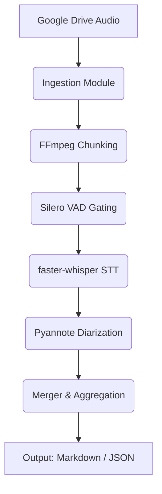

# meetingnoter

A highly secure, zero-cost (via Colab T4) voice analysis and speaker diarization pipeline for Customer Problem Fit (CPF) research.

 

## Key Features
- **Data Sovereignty:** Audio processing stays strictly within your Colab instance. No API data leaks.
- **Zero Cost Inference:** Uses free Google Colab GPUs instead of expensive STT APIs.
- **Japanese NLP Optimized:** Pre-gating with Silero VAD and Whisper parameter tuning to capture *aizuchi* and prevent hallucination.
- **Aggressive Memory Management:** FFmpeg chunking and explicit garbage collection prevent OOM errors on long 60-minute interviews.

## Architecture Overview
Built with AC-CDD, utilizing Dependency Injection and Pydantic schemas.



## Prerequisites
- Python 3.12+
- `uv` package manager

## Installation & Setup
```bash
git clone <repository_url>
cd meetingnoter
uv sync
```

## Usage
Run the interactive UAT:
```bash
uv run marimo edit tutorials/UAT_AND_TUTORIAL.py
```

## Development Workflow
- Linter: `uv run ruff check .`
- Type Checker: `uv run mypy .`
- Tests: `uv run pytest`

## License
MIT License
