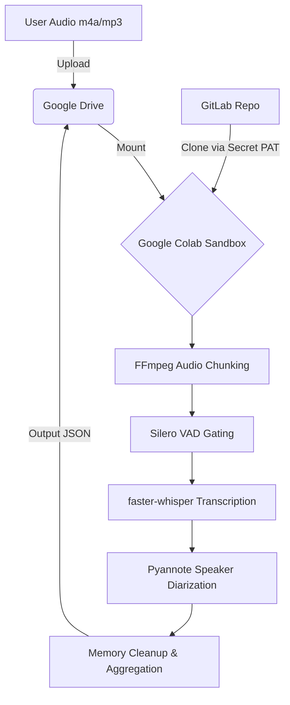

# MeetingNoter

MeetingNoter is a highly secure, zero-cost voice analysis and diarization pipeline designed specifically for Customer Problem Fit (CPF) verification and user interview transcriptions. By orchestrating open-source models (like faster-whisper and Pyannote) within a Google Colab free tier environment, it eliminates commercial API costs while ensuring absolute data privacy.


## Key Features
* **Zero-Cost Inference**: Fully utilizes the Google Colab T4 GPU free tier, eliminating pay-as-you-go commercial STT API costs.
* **Absolute Data Sovereignty**: All processing occurs within your own Google Drive and Colab sandbox. No PII or confidential voice data is ever sent to third-party endpoints.
* **Advanced Diarization**: Accurately separates multiple speakers even during overlapping speech, a common occurrence in conversational Japanese (e.g., Aizuchi).
* **Robust Memory Management**: Automatically chunks long audio files and clears VRAM to prevent Out-of-Memory (OOM) crashes, allowing reliable processing of multi-hour recordings.
* **Optimized for Japanese**: specifically tuned Voice Activity Detection (VAD) and Whisper parameters designed to prevent the typical hallucination loops and dropouts common when processing East Asian languages.

## Architecture Overview
MeetingNoter relies on a strict boundary-management architecture. The audio is fetched from a secure Google Drive, chunked locally, and strictly filtered using Silero VAD. It is then transcribed via faster-whisper and diarized via Pyannote.



## Prerequisites
* Python 3.12+
* [uv](https://github.com/astral-sh/uv) (Extremely fast Python package installer and resolver)
* Google Colab Account (for cloud execution)
* GitLab Personal Access Token (PAT)

## Installation & Setup

Initialize the project locally using `uv`:

```bash
# Clone the repository
git clone https://gitlab.com/your-org/meetingnoter.git
cd meetingnoter

# Install dependencies using uv
uv sync

# (Optional) Copy environment variables
cp .env.example .env
```

## Usage

**Quick Start Execution:**
To execute the pipeline locally or within your Colab instance:

```bash
uv run python main.py
```
*(Note: In the full cloud architecture, this is orchestrated via a Colab Notebook retrieving its configuration via Colab Secrets.)*

## Development Workflow

This project adheres to strict type-checking and linting standards. The development roadmap is strictly divided into 8 iterative implementation cycles, focusing on additive feature integration and memory profiling.

To run the linter:
```bash
uv run ruff check .
```

To run type checking:
```bash
uv run mypy src
```

To run the test suite:
```bash
uv run pytest
```

## Project Structure

```text
meetingnoter/
├── src/
│   ├── core/              # Pydantic models & config
│   ├── pipeline/          # Orchestrators and chunking logic
│   └── utils/             # Memory management and auth
├── tests/                 # Unit, integration, and E2E tests
├── dev_documents/         # Architecture and testing specs
├── pyproject.toml         # Dependencies and tool configs
└── README.md
```

## License
MIT License
