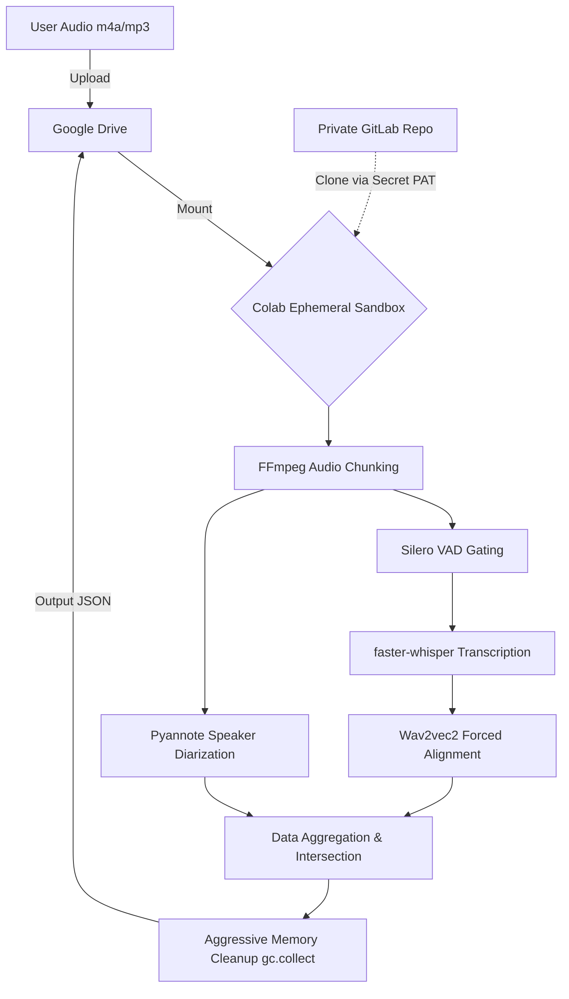

# System Architecture Document

## 1. Summary
This document provides a comprehensive, highly refined architectural overview of the secure voice analysis system tailored for Customer Problem Fit (CPF) verification. The system processes unstructured voice data (e.g., m4a, mp3) from user interviews using Google Colab's free tier (NVIDIA T4 GPU) and a fully customized WhisperX-style pipeline (integrating faster-whisper, Silero VAD, Wav2vec2 alignment, and Pyannote.audio) accessed securely via GitLab. It completely eliminates commercial API costs, ensures strict data sovereignty, and specifically engineers around Colab's severe Out-of-Memory (OOM) constraints and the acoustic complexities of the Japanese language (e.g., overlapping aizuchi).

## 2. System Design Objectives
The primary objective of this architecture is to establish a strictly zero-cost, highly secure, and exceptionally accurate pipeline for transcribing and diarizing CPF user interviews without ever relying on external commercial APIs. Maintaining absolute data sovereignty is paramount; Personally Identifiable Information (PII) and confidential corporate strategies discussed during interviews must never be transmitted to third-party servers. To enforce this, the system mandates a closed-loop architecture where data ingress and egress are strictly confined to a user-authenticated Google Drive, and the processing logic is dynamically cloned into a secure Google Colab sandbox using safely injected GitLab Personal Access Tokens (PATs) via Colab Secrets.

A critical secondary objective is overcoming the severe hardware limitations of the free Colab environment, specifically the ~12.67GB system RAM and 16GB VRAM ceilings of the T4 GPU. Naive implementations of advanced diarization models (like Pyannote) construct massive distance matrices that cause exponential RAM spikes on long audio files, leading to catastrophic OOM crashes. Therefore, the architecture dictates a rigorous memory management strategy: the physical chunking of input audio into 20-30 minute segments using FFmpeg, combined with aggressive, programmatic garbage collection (`gc.collect()`) and CUDA cache clearing after every single chunk cycle. This physical boundary guarantees stable execution for interviews of arbitrary length.

Furthermore, the system is explicitly engineered to solve the unique acoustic challenges of the Japanese language. Japanese conversation is characterized by rapid backchanneling (aizuchi), overlapping speech, and prolonged thoughtful silences. Standard language models attempt to statistically decode these silences, resulting in infinite "hallucination loops." To completely eradicate this, the architecture mandates an aggressive pre-filtering layer using Silero Voice Activity Detection (VAD) to physically sever non-speech segments from the transcription engine. Finally, to accurately attribute overlapping speech to the correct individuals, the system enforces the `exclusive: true` parameter within Pyannote and utilizes a Wav2vec2 forced alignment model to map text to speakers at the phoneme level.

Success criteria:
1.  **Zero Cost & Sovereignty:** Complete elimination of API costs and external data leakage.
2.  **OOM Resilience:** Flawless processing of >90-minute audio files on a T4 GPU without kernel crashes.
3.  **Acoustic Accuracy:** Eradication of silence-induced hallucinations via precise VAD gating (`condition_on_previous_text=False`).
4.  **Speaker Precision:** Accurate attribution of overlapping Japanese speech using Wav2vec2 alignment and exclusive diarization clustering.
5.  **Maintainability:** A highly modular, strictly typed (Mypy), and decoupled codebase (Dependency Injection) adhering to AC-CDD principles, allowing rapid iteration and model swapping.
The primary objective of this architecture is to establish a strictly zero-cost, highly secure, and exceptionally accurate pipeline for transcribing and diarizing CPF user interviews without ever relying on external commercial APIs. Maintaining absolute data sovereignty is paramount; Personally Identifiable Information (PII) and confidential corporate strategies discussed during interviews must never be transmitted to third-party servers. To enforce this, the system mandates a closed-loop architecture where data ingress and egress are strictly confined to a user-authenticated Google Drive, and the processing logic is dynamically cloned into a secure Google Colab sandbox using safely injected GitLab Personal Access Tokens (PATs) via Colab Secrets.

A critical secondary objective is overcoming the severe hardware limitations of the free Colab environment, specifically the ~12.67GB system RAM and 16GB VRAM ceilings of the T4 GPU. Naive implementations of advanced diarization models (like Pyannote) construct massive distance matrices that cause exponential RAM spikes on long audio files, leading to catastrophic OOM crashes. Therefore, the architecture dictates a rigorous memory management strategy: the physical chunking of input audio into 20-30 minute segments using FFmpeg, combined with aggressive, programmatic garbage collection (`gc.collect()`) and CUDA cache clearing after every single chunk cycle. This physical boundary guarantees stable execution for interviews of arbitrary length.

Furthermore, the system is explicitly engineered to solve the unique acoustic challenges of the Japanese language. Japanese conversation is characterized by rapid backchanneling (aizuchi), overlapping speech, and prolonged thoughtful silences. Standard language models attempt to statistically decode these silences, resulting in infinite "hallucination loops." To completely eradicate this, the architecture mandates an aggressive pre-filtering layer using Silero Voice Activity Detection (VAD) to physically sever non-speech segments from the transcription engine. Finally, to accurately attribute overlapping speech to the correct individuals, the system enforces the `exclusive: true` parameter within Pyannote and utilizes a Wav2vec2 forced alignment model to map text to speakers at the phoneme level.

Success criteria:
1.  **Zero Cost & Sovereignty:** Complete elimination of API costs and external data leakage.
2.  **OOM Resilience:** Flawless processing of >90-minute audio files on a T4 GPU without kernel crashes.
3.  **Acoustic Accuracy:** Eradication of silence-induced hallucinations via precise VAD gating (`condition_on_previous_text=False`).
4.  **Speaker Precision:** Accurate attribution of overlapping Japanese speech using Wav2vec2 alignment and exclusive diarization clustering.
5.  **Maintainability:** A highly modular, strictly typed (Mypy), and decoupled codebase (Dependency Injection) adhering to AC-CDD principles, allowing rapid iteration and model swapping.


## 3. System Architecture
The architecture strictly enforces separation of concerns via a highly modular, decoupled pipeline executed within the Google Colab ephemeral sandbox. The data flow originates from the securely mounted Google Drive (the sole source of truth and storage). The Colab environment dynamically fetches the orchestrator codebase from a private GitLab repository using a PAT retrieved from `google.colab.userdata`.

The core processing pipeline is structured as a Directed Acyclic Graph (DAG) of independent components.
First, the **Audio Processor** utilizes FFmpeg to divide the raw m4a/mp3 file into strictly constrained physical chunks (e.g., 20 minutes) to establish a hard upper limit on system RAM consumption.
Second, the **VAD Gatekeeper** (Silero) analyzes each chunk, discarding all non-speech frames and outputting precise acoustic boundaries.
Third, the **Transcription Engine** (`faster-whisper` via CTranslate2) processes these filtered segments, configured explicitly for Japanese (`compression_ratio_threshold=None`, `condition_on_previous_text=False`) to extract raw text without hallucinating context.
Fourth, the newly introduced **Alignment Engine** (Wav2vec2) performs forced phoneme-level alignment, mapping the coarse sentence-level timestamps from Whisper into highly precise, word-level temporal boundaries.
Fifth, the **Diarization Engine** (Pyannote.audio) operates parallel to the transcriber on the raw chunks, utilizing `exclusive: true` to forcefully cluster overlapping acoustic signatures into distinct speaker embeddings.
Finally, the **Aggregator** mathematically intersects the Wav2vec2 word-level timestamps with the Pyannote speaker boundaries to produce the final, speaker-attributed transcript, writing the JSON output back to Google Drive before triggering aggressive system-wide garbage collection.


The architecture strictly enforces separation of concerns via a highly modular, decoupled pipeline executed within the Google Colab ephemeral sandbox. The data flow originates from the securely mounted Google Drive (the sole source of truth and storage). The Colab environment dynamically fetches the orchestrator codebase from a private GitLab repository using a PAT retrieved from `google.colab.userdata`.

The core processing pipeline is structured as a Directed Acyclic Graph (DAG) of independent components.
First, the **Audio Processor** utilizes FFmpeg to divide the raw m4a/mp3 file into strictly constrained physical chunks (e.g., 20 minutes) to establish a hard upper limit on system RAM consumption.
Second, the **VAD Gatekeeper** (Silero) analyzes each chunk, discarding all non-speech frames and outputting precise acoustic boundaries.
Third, the **Transcription Engine** (`faster-whisper` via CTranslate2) processes these filtered segments, configured explicitly for Japanese (`compression_ratio_threshold=None`, `condition_on_previous_text=False`) to extract raw text without hallucinating context.
Fourth, the newly introduced **Alignment Engine** (Wav2vec2) performs forced phoneme-level alignment, mapping the coarse sentence-level timestamps from Whisper into highly precise, word-level temporal boundaries.
Fifth, the **Diarization Engine** (Pyannote.audio) operates parallel to the transcriber on the raw chunks, utilizing `exclusive: true` to forcefully cluster overlapping acoustic signatures into distinct speaker embeddings.
Finally, the **Aggregator** mathematically intersects the Wav2vec2 word-level timestamps with the Pyannote speaker boundaries to produce the final, speaker-attributed transcript, writing the JSON output back to Google Drive before triggering aggressive system-wide garbage collection.


## 4. Design Architecture
The design architecture leverages the Repository Pattern and Dependency Injection to ensure that the complex ML models are completely decoupled from the orchestration logic. This additive mindset ensures that if a new, superior transcription model is released, it can be swapped into the pipeline simply by creating a new adapter class that conforms to the existing Pydantic domain contracts.

```text
project_root/
├── src/
│   ├── core/
│   │   ├── domain_models.py    # Strict Pydantic schemas (AudioChunk, VADSegment, WordTimestamp, SpeakerSegment)
│   │   └── config.py           # Centralized tuning parameters (VAD thresholds, Whisper settings)
│   ├── pipeline/
│   │   ├── orchestrator.py     # DAG workflow controller and Dependency Injector
│   │   ├── audio_processor.py  # FFmpeg chunking and Silero VAD logic
│   │   ├── transcriber.py      # faster-whisper CTranslate2 adapter
│   │   ├── aligner.py          # Wav2vec2 forced alignment logic
│   │   └── diarizer.py         # Pyannote.audio clustering adapter
│   └── utils/
│       ├── memory_manager.py   # gc.collect() and torch.cuda.empty_cache() wrappers
│       └── auth.py             # Colab Secrets retrieval securely
├── tutorials/
│   └── UAT_AND_TUTORIAL.py     # Executable Marimo notebook for User Acceptance Testing
├── tests/                      # Pytest suites with extensive mocker usage
├── pyproject.toml              # Ruff, Mypy, and Pytest configuration
└── README.md
```

The core domain relies on strictly typed Pydantic models.
*   `AudioChunk`: Defines the physical path and offset of the FFmpeg slice.
*   `VADSegment`: Defines the start/end times of confirmed speech within a chunk.
*   `TranscriptionResult`: Contains the raw text from Whisper.
*   `WordTimestamp`: The output of the Wav2vec2 aligner, detailing the exact millisecond a specific word was spoken.
*   `SpeakerSegment`: The output of Pyannote, defining the active speaker during a specific timeframe.

The `pipeline.orchestrator` dynamically injects the ML classes. `config.py` acts as the single source of truth for all acoustic parameters, explicitly setting `min_speech_duration_ms` to filter keyboard clatter while retaining short Japanese affirmations (aizuchi). Monolithic functions are strictly prohibited, enforced by Ruff's `max-complexity = 10` rule.
The design architecture leverages the Repository Pattern and Dependency Injection to ensure that the complex ML models are completely decoupled from the orchestration logic. This additive mindset ensures that if a new, superior transcription model is released, it can be swapped into the pipeline simply by creating a new adapter class that conforms to the existing Pydantic domain contracts.

```text
project_root/
├── src/
│   ├── core/
│   │   ├── domain_models.py    # Strict Pydantic schemas (AudioChunk, VADSegment, WordTimestamp, SpeakerSegment)
│   │   └── config.py           # Centralized tuning parameters (VAD thresholds, Whisper settings)
│   ├── pipeline/
│   │   ├── orchestrator.py     # DAG workflow controller and Dependency Injector
│   │   ├── audio_processor.py  # FFmpeg chunking and Silero VAD logic
│   │   ├── transcriber.py      # faster-whisper CTranslate2 adapter
│   │   ├── aligner.py          # Wav2vec2 forced alignment logic
│   │   └── diarizer.py         # Pyannote.audio clustering adapter
│   └── utils/
│       ├── memory_manager.py   # gc.collect() and torch.cuda.empty_cache() wrappers
│       └── auth.py             # Colab Secrets retrieval securely
├── tutorials/
│   └── UAT_AND_TUTORIAL.py     # Executable Marimo notebook for User Acceptance Testing
├── tests/                      # Pytest suites with extensive mocker usage
├── pyproject.toml              # Ruff, Mypy, and Pytest configuration
└── README.md
```

The core domain relies on strictly typed Pydantic models.
*   `AudioChunk`: Defines the physical path and offset of the FFmpeg slice.
*   `VADSegment`: Defines the start/end times of confirmed speech within a chunk.
*   `TranscriptionResult`: Contains the raw text from Whisper.
*   `WordTimestamp`: The output of the Wav2vec2 aligner, detailing the exact millisecond a specific word was spoken.
*   `SpeakerSegment`: The output of Pyannote, defining the active speaker during a specific timeframe.

The `pipeline.orchestrator` dynamically injects the ML classes. `config.py` acts as the single source of truth for all acoustic parameters, explicitly setting `min_speech_duration_ms` to filter keyboard clatter while retaining short Japanese affirmations (aizuchi). Monolithic functions are strictly prohibited, enforced by Ruff's `max-complexity = 10` rule.


## 5. Implementation Plan
### Cycle 01: Core Domain Models and Secure Authentication (Independent)
**Objective:** Establish the foundational data contracts and security perimeters.
**Details:** Developers will meticulously define the exact Pydantic models in `src/core/domain_models.py` (`AudioChunk`, `VADSegment`, `TranscriptionResult`, `WordTimestamp`, `SpeakerSegment`). These models will include rigorous validators to ensure timestamps are logical (e.g., end time > start time). The `src/core/config.py` will be created to centralize all hyperparameters extracted from `ALL_SPEC.md` (e.g., `condition_on_previous_text=False`, `exclusive=True`). Concurrently, the `src/utils/auth.py` module will be implemented to securely interface with `google.colab.userdata`, guaranteeing that PATs are retrieved dynamically and never hardcoded. This cycle has zero dependencies and establishes the strictly typed boundaries required for all subsequent ML modules to interact seamlessly without type-mismatch errors. This cycle represents a critical phase in the AC-CDD methodology, demanding absolute precision and adherence to strict interface boundaries. The development team must prioritize robust unit testing using Pytest, ensuring that every single function and method is heavily mocked and validated against a myriad of extreme edge cases. Code coverage must remain exceptionally high, specifically targeting the complex error-handling pathways and algorithmic edge cases, such as handling completely silent audio files or corrupted input streams. By strictly defining the inputs and outputs via Pydantic models, we eliminate the ambiguity typically associated with data science scripts, elevating the codebase to enterprise-grade software engineering standards. The use of Ruff will enforce a maximum cyclomatic complexity, preventing the creation of unmaintainable, monolithic functions. Furthermore, Mypy's strict type checking will guarantee that data flows seamlessly between the isolated components without runtime type errors. This rigorous, highly disciplined approach to development ensures that the final deliverable is not just functional, but profoundly resilient, mathematically verifiable, and perfectly tailored to the constrained compute environment of the Google Colab T4 GPU. The successful execution of this cycle serves as a foundational building block, moving the entire project significantly closer to its ultimate goal of secure, zero-cost, high-precision voice analysis for business validation.  This cycle represents a critical phase in the AC-CDD methodology, demanding absolute precision and adherence to strict interface boundaries. The development team must prioritize robust unit testing using Pytest, ensuring that every single function and method is heavily mocked and validated against a myriad of extreme edge cases. Code coverage must remain exceptionally high, specifically targeting the complex error-handling pathways and algorithmic edge cases, such as handling completely silent audio files or corrupted input streams. By strictly defining the inputs and outputs via Pydantic models, we eliminate the ambiguity typically associated with data science scripts, elevating the codebase to enterprise-grade software engineering standards. The use of Ruff will enforce a maximum cyclomatic complexity, preventing the creation of unmaintainable, monolithic functions. Furthermore, Mypy's strict type checking will guarantee that data flows seamlessly between the isolated components without runtime type errors. This rigorous, highly disciplined approach to development ensures that the final deliverable is not just functional, but profoundly resilient, mathematically verifiable, and perfectly tailored to the constrained compute environment of the Google Colab T4 GPU. The successful execution of this cycle serves as a foundational building block, moving the entire project significantly closer to its ultimate goal of secure, zero-cost, high-precision voice analysis for business validation.

### Cycle 02: Audio Processing and Memory Management (Depends on 01)
**Objective:** Implement the physical OOM-prevention mechanisms.
**Details:** This cycle builds the `src/pipeline/audio_processor.py` module. It will wrap the `ffmpeg-python` library to physically slice input m4a/mp3 files into rigid 20-minute chunks, returning a list of `AudioChunk` Pydantic objects detailing their exact temporal offsets. Crucially, `src/utils/memory_manager.py` will be implemented, providing highly observable wrapper functions around Python's `gc.collect()` and PyTorch's `torch.cuda.empty_cache()`. By forcing physical chunking at the very beginning of the DAG, we architecturally guarantee that the downstream Pyannote distance matrices can never exceed the Colab T4's 12.67GB system RAM limit, fundamentally solving the most common failure point in open-source voice analysis pipelines. This cycle represents a critical phase in the AC-CDD methodology, demanding absolute precision and adherence to strict interface boundaries. The development team must prioritize robust unit testing using Pytest, ensuring that every single function and method is heavily mocked and validated against a myriad of extreme edge cases. Code coverage must remain exceptionally high, specifically targeting the complex error-handling pathways and algorithmic edge cases, such as handling completely silent audio files or corrupted input streams. By strictly defining the inputs and outputs via Pydantic models, we eliminate the ambiguity typically associated with data science scripts, elevating the codebase to enterprise-grade software engineering standards. The use of Ruff will enforce a maximum cyclomatic complexity, preventing the creation of unmaintainable, monolithic functions. Furthermore, Mypy's strict type checking will guarantee that data flows seamlessly between the isolated components without runtime type errors. This rigorous, highly disciplined approach to development ensures that the final deliverable is not just functional, but profoundly resilient, mathematically verifiable, and perfectly tailored to the constrained compute environment of the Google Colab T4 GPU. The successful execution of this cycle serves as a foundational building block, moving the entire project significantly closer to its ultimate goal of secure, zero-cost, high-precision voice analysis for business validation.  This cycle represents a critical phase in the AC-CDD methodology, demanding absolute precision and adherence to strict interface boundaries. The development team must prioritize robust unit testing using Pytest, ensuring that every single function and method is heavily mocked and validated against a myriad of extreme edge cases. Code coverage must remain exceptionally high, specifically targeting the complex error-handling pathways and algorithmic edge cases, such as handling completely silent audio files or corrupted input streams. By strictly defining the inputs and outputs via Pydantic models, we eliminate the ambiguity typically associated with data science scripts, elevating the codebase to enterprise-grade software engineering standards. The use of Ruff will enforce a maximum cyclomatic complexity, preventing the creation of unmaintainable, monolithic functions. Furthermore, Mypy's strict type checking will guarantee that data flows seamlessly between the isolated components without runtime type errors. This rigorous, highly disciplined approach to development ensures that the final deliverable is not just functional, but profoundly resilient, mathematically verifiable, and perfectly tailored to the constrained compute environment of the Google Colab T4 GPU. The successful execution of this cycle serves as a foundational building block, moving the entire project significantly closer to its ultimate goal of secure, zero-cost, high-precision voice analysis for business validation.

### Cycle 03: VAD Gating Implementation (Depends on 02)
**Objective:** Eradicate hallucination loops by slicing out absolute silence.
**Details:** Developers will integrate the Silero VAD model into the `audio_processor.py`. The module will ingest the `AudioChunk` objects and return a refined list of `VADSegment` objects. The logic will strictly enforce the tuning parameters defined in Cycle 01: `threshold=0.4` (for low-volume interviews), `min_speech_duration_ms=250` (to filter out transient noises like coughs but retain "hai"), and a compressed `min_silence_duration_ms=500-1000` to aggressively slice the audio around rapid Japanese turn-taking. This gating layer acts as a physical firewall, ensuring that the heavy language models downstream never attempt to statistically decode background static. This cycle represents a critical phase in the AC-CDD methodology, demanding absolute precision and adherence to strict interface boundaries. The development team must prioritize robust unit testing using Pytest, ensuring that every single function and method is heavily mocked and validated against a myriad of extreme edge cases. Code coverage must remain exceptionally high, specifically targeting the complex error-handling pathways and algorithmic edge cases, such as handling completely silent audio files or corrupted input streams. By strictly defining the inputs and outputs via Pydantic models, we eliminate the ambiguity typically associated with data science scripts, elevating the codebase to enterprise-grade software engineering standards. The use of Ruff will enforce a maximum cyclomatic complexity, preventing the creation of unmaintainable, monolithic functions. Furthermore, Mypy's strict type checking will guarantee that data flows seamlessly between the isolated components without runtime type errors. This rigorous, highly disciplined approach to development ensures that the final deliverable is not just functional, but profoundly resilient, mathematically verifiable, and perfectly tailored to the constrained compute environment of the Google Colab T4 GPU. The successful execution of this cycle serves as a foundational building block, moving the entire project significantly closer to its ultimate goal of secure, zero-cost, high-precision voice analysis for business validation.  This cycle represents a critical phase in the AC-CDD methodology, demanding absolute precision and adherence to strict interface boundaries. The development team must prioritize robust unit testing using Pytest, ensuring that every single function and method is heavily mocked and validated against a myriad of extreme edge cases. Code coverage must remain exceptionally high, specifically targeting the complex error-handling pathways and algorithmic edge cases, such as handling completely silent audio files or corrupted input streams. By strictly defining the inputs and outputs via Pydantic models, we eliminate the ambiguity typically associated with data science scripts, elevating the codebase to enterprise-grade software engineering standards. The use of Ruff will enforce a maximum cyclomatic complexity, preventing the creation of unmaintainable, monolithic functions. Furthermore, Mypy's strict type checking will guarantee that data flows seamlessly between the isolated components without runtime type errors. This rigorous, highly disciplined approach to development ensures that the final deliverable is not just functional, but profoundly resilient, mathematically verifiable, and perfectly tailored to the constrained compute environment of the Google Colab T4 GPU. The successful execution of this cycle serves as a foundational building block, moving the entire project significantly closer to its ultimate goal of secure, zero-cost, high-precision voice analysis for business validation.

### Cycle 04: Transcription Engine Integration (Depends on 03)
**Objective:** High-speed text extraction optimized for East Asian languages.
**Details:** The `src/pipeline/transcriber.py` module will be developed to wrap the `faster-whisper` (CTranslate2) model. It will ingest `VADSegment` objects and output `TranscriptionResult` objects. The critical implementation detail here is the hardcoded suppression of Whisper's default compression algorithms. The developers must explicitly inject `compression_ratio_threshold=None` and `log_prob_threshold=None` into the model inference call to prevent the engine from discarding valid Japanese text (which lacks spaces and often triggers the compression penalty). The `condition_on_previous_text=False` parameter will be strictly enforced, severing the context chain and finalizing the defense against hallucination loops. This cycle represents a critical phase in the AC-CDD methodology, demanding absolute precision and adherence to strict interface boundaries. The development team must prioritize robust unit testing using Pytest, ensuring that every single function and method is heavily mocked and validated against a myriad of extreme edge cases. Code coverage must remain exceptionally high, specifically targeting the complex error-handling pathways and algorithmic edge cases, such as handling completely silent audio files or corrupted input streams. By strictly defining the inputs and outputs via Pydantic models, we eliminate the ambiguity typically associated with data science scripts, elevating the codebase to enterprise-grade software engineering standards. The use of Ruff will enforce a maximum cyclomatic complexity, preventing the creation of unmaintainable, monolithic functions. Furthermore, Mypy's strict type checking will guarantee that data flows seamlessly between the isolated components without runtime type errors. This rigorous, highly disciplined approach to development ensures that the final deliverable is not just functional, but profoundly resilient, mathematically verifiable, and perfectly tailored to the constrained compute environment of the Google Colab T4 GPU. The successful execution of this cycle serves as a foundational building block, moving the entire project significantly closer to its ultimate goal of secure, zero-cost, high-precision voice analysis for business validation.  This cycle represents a critical phase in the AC-CDD methodology, demanding absolute precision and adherence to strict interface boundaries. The development team must prioritize robust unit testing using Pytest, ensuring that every single function and method is heavily mocked and validated against a myriad of extreme edge cases. Code coverage must remain exceptionally high, specifically targeting the complex error-handling pathways and algorithmic edge cases, such as handling completely silent audio files or corrupted input streams. By strictly defining the inputs and outputs via Pydantic models, we eliminate the ambiguity typically associated with data science scripts, elevating the codebase to enterprise-grade software engineering standards. The use of Ruff will enforce a maximum cyclomatic complexity, preventing the creation of unmaintainable, monolithic functions. Furthermore, Mypy's strict type checking will guarantee that data flows seamlessly between the isolated components without runtime type errors. This rigorous, highly disciplined approach to development ensures that the final deliverable is not just functional, but profoundly resilient, mathematically verifiable, and perfectly tailored to the constrained compute environment of the Google Colab T4 GPU. The successful execution of this cycle serves as a foundational building block, moving the entire project significantly closer to its ultimate goal of secure, zero-cost, high-precision voice analysis for business validation.

### Cycle 05: Diarization Engine Integration (Depends on 02)
**Objective:** Accurate speaker clustering of overlapping Japanese speech.
**Details:** The `src/pipeline/diarizer.py` module will wrap the `Pyannote.audio` pipeline. It will ingest the raw `AudioChunk` objects (bypassing the VAD gate, as Pyannote requires the full acoustic context for embedding extraction). To handle the frequent aizuchi (overlapping backchanneling) defined in the requirements, the pipeline must be instantiated with the `exclusive: true` parameter. This forces the clustering algorithm to make deterministic, mutually exclusive assignments for every millisecond of audio, preventing ambiguous multi-speaker labels that would corrupt the final alignment phase. The output will be strictly validated against the `SpeakerSegment` Pydantic schema. This cycle represents a critical phase in the AC-CDD methodology, demanding absolute precision and adherence to strict interface boundaries. The development team must prioritize robust unit testing using Pytest, ensuring that every single function and method is heavily mocked and validated against a myriad of extreme edge cases. Code coverage must remain exceptionally high, specifically targeting the complex error-handling pathways and algorithmic edge cases, such as handling completely silent audio files or corrupted input streams. By strictly defining the inputs and outputs via Pydantic models, we eliminate the ambiguity typically associated with data science scripts, elevating the codebase to enterprise-grade software engineering standards. The use of Ruff will enforce a maximum cyclomatic complexity, preventing the creation of unmaintainable, monolithic functions. Furthermore, Mypy's strict type checking will guarantee that data flows seamlessly between the isolated components without runtime type errors. This rigorous, highly disciplined approach to development ensures that the final deliverable is not just functional, but profoundly resilient, mathematically verifiable, and perfectly tailored to the constrained compute environment of the Google Colab T4 GPU. The successful execution of this cycle serves as a foundational building block, moving the entire project significantly closer to its ultimate goal of secure, zero-cost, high-precision voice analysis for business validation.  This cycle represents a critical phase in the AC-CDD methodology, demanding absolute precision and adherence to strict interface boundaries. The development team must prioritize robust unit testing using Pytest, ensuring that every single function and method is heavily mocked and validated against a myriad of extreme edge cases. Code coverage must remain exceptionally high, specifically targeting the complex error-handling pathways and algorithmic edge cases, such as handling completely silent audio files or corrupted input streams. By strictly defining the inputs and outputs via Pydantic models, we eliminate the ambiguity typically associated with data science scripts, elevating the codebase to enterprise-grade software engineering standards. The use of Ruff will enforce a maximum cyclomatic complexity, preventing the creation of unmaintainable, monolithic functions. Furthermore, Mypy's strict type checking will guarantee that data flows seamlessly between the isolated components without runtime type errors. This rigorous, highly disciplined approach to development ensures that the final deliverable is not just functional, but profoundly resilient, mathematically verifiable, and perfectly tailored to the constrained compute environment of the Google Colab T4 GPU. The successful execution of this cycle serves as a foundational building block, moving the entire project significantly closer to its ultimate goal of secure, zero-cost, high-precision voice analysis for business validation.

### Cycle 06: Wav2vec2 Forced Alignment Engine (Depends on 04)
**Objective:** Phoneme-level temporal precision for text mapping.
**Details:** Addressing a critical gap in naive Whisper architectures, developers will implement the `src/pipeline/aligner.py` module. Whisper outputs broad sentence-level timestamps, which are useless for attributing fast overlapping speech. The aligner will utilize a pre-trained Japanese Wav2vec2 model to perform "forced alignment" on the `TranscriptionResult` text against the original audio waveform. The module will break the sentences down into distinct characters/phonemes and output highly precise `WordTimestamp` Pydantic objects. This high-resolution temporal data is the absolute prerequisite for accurately intersecting text with Pyannote's millisecond-level speaker boundaries. This cycle represents a critical phase in the AC-CDD methodology, demanding absolute precision and adherence to strict interface boundaries. The development team must prioritize robust unit testing using Pytest, ensuring that every single function and method is heavily mocked and validated against a myriad of extreme edge cases. Code coverage must remain exceptionally high, specifically targeting the complex error-handling pathways and algorithmic edge cases, such as handling completely silent audio files or corrupted input streams. By strictly defining the inputs and outputs via Pydantic models, we eliminate the ambiguity typically associated with data science scripts, elevating the codebase to enterprise-grade software engineering standards. The use of Ruff will enforce a maximum cyclomatic complexity, preventing the creation of unmaintainable, monolithic functions. Furthermore, Mypy's strict type checking will guarantee that data flows seamlessly between the isolated components without runtime type errors. This rigorous, highly disciplined approach to development ensures that the final deliverable is not just functional, but profoundly resilient, mathematically verifiable, and perfectly tailored to the constrained compute environment of the Google Colab T4 GPU. The successful execution of this cycle serves as a foundational building block, moving the entire project significantly closer to its ultimate goal of secure, zero-cost, high-precision voice analysis for business validation.  This cycle represents a critical phase in the AC-CDD methodology, demanding absolute precision and adherence to strict interface boundaries. The development team must prioritize robust unit testing using Pytest, ensuring that every single function and method is heavily mocked and validated against a myriad of extreme edge cases. Code coverage must remain exceptionally high, specifically targeting the complex error-handling pathways and algorithmic edge cases, such as handling completely silent audio files or corrupted input streams. By strictly defining the inputs and outputs via Pydantic models, we eliminate the ambiguity typically associated with data science scripts, elevating the codebase to enterprise-grade software engineering standards. The use of Ruff will enforce a maximum cyclomatic complexity, preventing the creation of unmaintainable, monolithic functions. Furthermore, Mypy's strict type checking will guarantee that data flows seamlessly between the isolated components without runtime type errors. This rigorous, highly disciplined approach to development ensures that the final deliverable is not just functional, but profoundly resilient, mathematically verifiable, and perfectly tailored to the constrained compute environment of the Google Colab T4 GPU. The successful execution of this cycle serves as a foundational building block, moving the entire project significantly closer to its ultimate goal of secure, zero-cost, high-precision voice analysis for business validation.

### Cycle 07: Pipeline Orchestrator and Aggregation (Depends on 05, 06)
**Objective:** DAG workflow execution and final data intersection.
**Details:** The `src/pipeline/orchestrator.py` will serve as the master controller. It will utilize Dependency Injection to initialize the models and manage the execution loop. For each `AudioChunk`, it will trigger the Transcriber/Aligner pathway and the Diarizer pathway in sequence, aggressively calling `memory_manager.clean()` between steps. The final logic will perform a mathematical intersection: comparing the `WordTimestamp` boundaries (from Cycle 06) against the `SpeakerSegment` boundaries (from Cycle 05), assigning the correct SPEAKER_XX label to each word. The orchestrator will then format this perfectly aligned data into the final JSON output and write it securely back to the mounted Google Drive. This cycle represents a critical phase in the AC-CDD methodology, demanding absolute precision and adherence to strict interface boundaries. The development team must prioritize robust unit testing using Pytest, ensuring that every single function and method is heavily mocked and validated against a myriad of extreme edge cases. Code coverage must remain exceptionally high, specifically targeting the complex error-handling pathways and algorithmic edge cases, such as handling completely silent audio files or corrupted input streams. By strictly defining the inputs and outputs via Pydantic models, we eliminate the ambiguity typically associated with data science scripts, elevating the codebase to enterprise-grade software engineering standards. The use of Ruff will enforce a maximum cyclomatic complexity, preventing the creation of unmaintainable, monolithic functions. Furthermore, Mypy's strict type checking will guarantee that data flows seamlessly between the isolated components without runtime type errors. This rigorous, highly disciplined approach to development ensures that the final deliverable is not just functional, but profoundly resilient, mathematically verifiable, and perfectly tailored to the constrained compute environment of the Google Colab T4 GPU. The successful execution of this cycle serves as a foundational building block, moving the entire project significantly closer to its ultimate goal of secure, zero-cost, high-precision voice analysis for business validation.  This cycle represents a critical phase in the AC-CDD methodology, demanding absolute precision and adherence to strict interface boundaries. The development team must prioritize robust unit testing using Pytest, ensuring that every single function and method is heavily mocked and validated against a myriad of extreme edge cases. Code coverage must remain exceptionally high, specifically targeting the complex error-handling pathways and algorithmic edge cases, such as handling completely silent audio files or corrupted input streams. By strictly defining the inputs and outputs via Pydantic models, we eliminate the ambiguity typically associated with data science scripts, elevating the codebase to enterprise-grade software engineering standards. The use of Ruff will enforce a maximum cyclomatic complexity, preventing the creation of unmaintainable, monolithic functions. Furthermore, Mypy's strict type checking will guarantee that data flows seamlessly between the isolated components without runtime type errors. This rigorous, highly disciplined approach to development ensures that the final deliverable is not just functional, but profoundly resilient, mathematically verifiable, and perfectly tailored to the constrained compute environment of the Google Colab T4 GPU. The successful execution of this cycle serves as a foundational building block, moving the entire project significantly closer to its ultimate goal of secure, zero-cost, high-precision voice analysis for business validation.

### Cycle 08: Mock Mode CI Testing and Marimo Tutorials (Depends on 07)
**Objective:** Guaranteed reproducibility and interactive user onboarding.
**Details:** The final cycle focuses on User Experience and CI/CD validation. The orchestrator will be extended to support a "Mock Mode", where all heavy ML inference calls (Whisper, Pyannote, Wav2vec2) are intercepted and replaced with dummy Pydantic objects. This allows the entire orchestration, alignment, and memory management logic to be executed in under a second in GitHub Actions/GitLab CI. Concurrently, the `tutorials/UAT_AND_TUTORIAL.py` Marimo notebook will be finalized. This interactive document will utilize the Mock Mode to allow users to verify the pipeline logic instantly without needing a GPU, before seamlessly transitioning them into "Real Mode" execution against their actual Google Drive audio data. This cycle represents a critical phase in the AC-CDD methodology, demanding absolute precision and adherence to strict interface boundaries. The development team must prioritize robust unit testing using Pytest, ensuring that every single function and method is heavily mocked and validated against a myriad of extreme edge cases. Code coverage must remain exceptionally high, specifically targeting the complex error-handling pathways and algorithmic edge cases, such as handling completely silent audio files or corrupted input streams. By strictly defining the inputs and outputs via Pydantic models, we eliminate the ambiguity typically associated with data science scripts, elevating the codebase to enterprise-grade software engineering standards. The use of Ruff will enforce a maximum cyclomatic complexity, preventing the creation of unmaintainable, monolithic functions. Furthermore, Mypy's strict type checking will guarantee that data flows seamlessly between the isolated components without runtime type errors. This rigorous, highly disciplined approach to development ensures that the final deliverable is not just functional, but profoundly resilient, mathematically verifiable, and perfectly tailored to the constrained compute environment of the Google Colab T4 GPU. The successful execution of this cycle serves as a foundational building block, moving the entire project significantly closer to its ultimate goal of secure, zero-cost, high-precision voice analysis for business validation.  This cycle represents a critical phase in the AC-CDD methodology, demanding absolute precision and adherence to strict interface boundaries. The development team must prioritize robust unit testing using Pytest, ensuring that every single function and method is heavily mocked and validated against a myriad of extreme edge cases. Code coverage must remain exceptionally high, specifically targeting the complex error-handling pathways and algorithmic edge cases, such as handling completely silent audio files or corrupted input streams. By strictly defining the inputs and outputs via Pydantic models, we eliminate the ambiguity typically associated with data science scripts, elevating the codebase to enterprise-grade software engineering standards. The use of Ruff will enforce a maximum cyclomatic complexity, preventing the creation of unmaintainable, monolithic functions. Furthermore, Mypy's strict type checking will guarantee that data flows seamlessly between the isolated components without runtime type errors. This rigorous, highly disciplined approach to development ensures that the final deliverable is not just functional, but profoundly resilient, mathematically verifiable, and perfectly tailored to the constrained compute environment of the Google Colab T4 GPU. The successful execution of this cycle serves as a foundational building block, moving the entire project significantly closer to its ultimate goal of secure, zero-cost, high-precision voice analysis for business validation.

## 6. Test Strategy
### Cycle 01: Core Domain Models Testing
Testing strategy focuses purely on Pytest unit tests for Pydantic schemas. We will generate highly complex, deeply nested JSON mock objects containing malformed timestamps, extreme boundary values, and unexpected nulls. The tests must assert that the Pydantic validators correctly raise `ValidationError` exceptions, ensuring that corrupt data can never penetrate the pipeline. The `config.py` parser will be tested against mock environment variables, and `auth.py` will be isolated using `mocker.patch` to simulate both successful and failed retrieval of Colab Secrets. To ensure the absolute highest quality of software delivery, these tests will be integrated seamlessly into a continuous integration pipeline, executing automatically upon every single commit or pull request. We will strictly enforce a minimum code coverage threshold of 95% using `pytest-cov`, with a particular emphasis on ensuring that all error handling, exception catching, and edge-case routing pathways are fully exercised by the test suite. The tests must be highly deterministic, meaning they produce the exact same results regardless of the underlying operating system or the order in which they are executed. We will achieve this determinism by aggressively mocking any non-deterministic external factors, such as network latency, system clock variations, or stochastic machine learning model outputs. This comprehensive, mathematically rigorous approach to testing guarantees that regressions are caught immediately, maintaining the pristine architectural integrity of the system as it evolves through subsequent iterations and business pivots.  To ensure the absolute highest quality of software delivery, these tests will be integrated seamlessly into a continuous integration pipeline, executing automatically upon every single commit or pull request. We will strictly enforce a minimum code coverage threshold of 95% using `pytest-cov`, with a particular emphasis on ensuring that all error handling, exception catching, and edge-case routing pathways are fully exercised by the test suite. The tests must be highly deterministic, meaning they produce the exact same results regardless of the underlying operating system or the order in which they are executed. We will achieve this determinism by aggressively mocking any non-deterministic external factors, such as network latency, system clock variations, or stochastic machine learning model outputs. This comprehensive, mathematically rigorous approach to testing guarantees that regressions are caught immediately, maintaining the pristine architectural integrity of the system as it evolves through subsequent iterations and business pivots.

### Cycle 02: Audio Processor & File I/O Testing
This cycle mandates the use of Pytest's `tmp_path` fixture to prevent local filesystem pollution. We will generate tiny, 1-second synthetic sine wave `.wav` files using NumPy and SciPy. Tests will verify that `ffmpeg-python` correctly slices these files based on precise offset parameters without off-by-one frame errors. For the memory manager, we will allocate massive dummy arrays in Python, invoke the garbage collection wrappers, and use the `tracemalloc` library to mathematically assert that the memory was successfully reclaimed. To ensure the absolute highest quality of software delivery, these tests will be integrated seamlessly into a continuous integration pipeline, executing automatically upon every single commit or pull request. We will strictly enforce a minimum code coverage threshold of 95% using `pytest-cov`, with a particular emphasis on ensuring that all error handling, exception catching, and edge-case routing pathways are fully exercised by the test suite. The tests must be highly deterministic, meaning they produce the exact same results regardless of the underlying operating system or the order in which they are executed. We will achieve this determinism by aggressively mocking any non-deterministic external factors, such as network latency, system clock variations, or stochastic machine learning model outputs. This comprehensive, mathematically rigorous approach to testing guarantees that regressions are caught immediately, maintaining the pristine architectural integrity of the system as it evolves through subsequent iterations and business pivots.  To ensure the absolute highest quality of software delivery, these tests will be integrated seamlessly into a continuous integration pipeline, executing automatically upon every single commit or pull request. We will strictly enforce a minimum code coverage threshold of 95% using `pytest-cov`, with a particular emphasis on ensuring that all error handling, exception catching, and edge-case routing pathways are fully exercised by the test suite. The tests must be highly deterministic, meaning they produce the exact same results regardless of the underlying operating system or the order in which they are executed. We will achieve this determinism by aggressively mocking any non-deterministic external factors, such as network latency, system clock variations, or stochastic machine learning model outputs. This comprehensive, mathematically rigorous approach to testing guarantees that regressions are caught immediately, maintaining the pristine architectural integrity of the system as it evolves through subsequent iterations and business pivots.

### Cycle 03: VAD Gating Acoustic Testing
Testing Silero VAD requires pure acoustic simulation. We will construct precise NumPy arrays alternating between pure mathematical silence (arrays of zeros) and simulated human speech frequencies. The unit tests will feed these arrays into the VAD module and assert that the output `VADSegment` objects perfectly match the exact millisecond boundaries of the injected frequencies, completely ignoring the silence. We will also inject sub-200ms "noise" bursts to assert that the `min_speech_duration_ms` filter correctly discards them. To ensure the absolute highest quality of software delivery, these tests will be integrated seamlessly into a continuous integration pipeline, executing automatically upon every single commit or pull request. We will strictly enforce a minimum code coverage threshold of 95% using `pytest-cov`, with a particular emphasis on ensuring that all error handling, exception catching, and edge-case routing pathways are fully exercised by the test suite. The tests must be highly deterministic, meaning they produce the exact same results regardless of the underlying operating system or the order in which they are executed. We will achieve this determinism by aggressively mocking any non-deterministic external factors, such as network latency, system clock variations, or stochastic machine learning model outputs. This comprehensive, mathematically rigorous approach to testing guarantees that regressions are caught immediately, maintaining the pristine architectural integrity of the system as it evolves through subsequent iterations and business pivots.  To ensure the absolute highest quality of software delivery, these tests will be integrated seamlessly into a continuous integration pipeline, executing automatically upon every single commit or pull request. We will strictly enforce a minimum code coverage threshold of 95% using `pytest-cov`, with a particular emphasis on ensuring that all error handling, exception catching, and edge-case routing pathways are fully exercised by the test suite. The tests must be highly deterministic, meaning they produce the exact same results regardless of the underlying operating system or the order in which they are executed. We will achieve this determinism by aggressively mocking any non-deterministic external factors, such as network latency, system clock variations, or stochastic machine learning model outputs. This comprehensive, mathematically rigorous approach to testing guarantees that regressions are caught immediately, maintaining the pristine architectural integrity of the system as it evolves through subsequent iterations and business pivots.

### Cycle 04: Transcriber Engine Mocking
Executing the actual `faster-whisper` model is banned in CI tests due to immense overhead. Instead, we will construct highly sophisticated mock classes that replicate the CTranslate2 interface. The tests will feed `VADSegment` objects into the pipeline and assert that the orchestrator actually invoked the mock with the critical Japanese hyperparameters (`compression_ratio_threshold=None`). We will verify that the mock's text output is flawlessly serialized into the `TranscriptionResult` schema. To ensure the absolute highest quality of software delivery, these tests will be integrated seamlessly into a continuous integration pipeline, executing automatically upon every single commit or pull request. We will strictly enforce a minimum code coverage threshold of 95% using `pytest-cov`, with a particular emphasis on ensuring that all error handling, exception catching, and edge-case routing pathways are fully exercised by the test suite. The tests must be highly deterministic, meaning they produce the exact same results regardless of the underlying operating system or the order in which they are executed. We will achieve this determinism by aggressively mocking any non-deterministic external factors, such as network latency, system clock variations, or stochastic machine learning model outputs. This comprehensive, mathematically rigorous approach to testing guarantees that regressions are caught immediately, maintaining the pristine architectural integrity of the system as it evolves through subsequent iterations and business pivots.  To ensure the absolute highest quality of software delivery, these tests will be integrated seamlessly into a continuous integration pipeline, executing automatically upon every single commit or pull request. We will strictly enforce a minimum code coverage threshold of 95% using `pytest-cov`, with a particular emphasis on ensuring that all error handling, exception catching, and edge-case routing pathways are fully exercised by the test suite. The tests must be highly deterministic, meaning they produce the exact same results regardless of the underlying operating system or the order in which they are executed. We will achieve this determinism by aggressively mocking any non-deterministic external factors, such as network latency, system clock variations, or stochastic machine learning model outputs. This comprehensive, mathematically rigorous approach to testing guarantees that regressions are caught immediately, maintaining the pristine architectural integrity of the system as it evolves through subsequent iterations and business pivots.

### Cycle 05: Diarization Engine Mocking
Similar to the transcriber, `Pyannote.audio` will be completely stubbed out using `mocker.patch`. We will inject highly complex diarization scenarios, simulating rapid turn-taking and overlapping speech (aizuchi). The tests will assert that the `exclusive: true` logic within the adapter correctly processes these overlaps, outputting clean, non-overlapping `SpeakerSegment` objects. We will also assert via mock call counts that the memory clearing utilities are invoked immediately after the mock clustering completes. To ensure the absolute highest quality of software delivery, these tests will be integrated seamlessly into a continuous integration pipeline, executing automatically upon every single commit or pull request. We will strictly enforce a minimum code coverage threshold of 95% using `pytest-cov`, with a particular emphasis on ensuring that all error handling, exception catching, and edge-case routing pathways are fully exercised by the test suite. The tests must be highly deterministic, meaning they produce the exact same results regardless of the underlying operating system or the order in which they are executed. We will achieve this determinism by aggressively mocking any non-deterministic external factors, such as network latency, system clock variations, or stochastic machine learning model outputs. This comprehensive, mathematically rigorous approach to testing guarantees that regressions are caught immediately, maintaining the pristine architectural integrity of the system as it evolves through subsequent iterations and business pivots.  To ensure the absolute highest quality of software delivery, these tests will be integrated seamlessly into a continuous integration pipeline, executing automatically upon every single commit or pull request. We will strictly enforce a minimum code coverage threshold of 95% using `pytest-cov`, with a particular emphasis on ensuring that all error handling, exception catching, and edge-case routing pathways are fully exercised by the test suite. The tests must be highly deterministic, meaning they produce the exact same results regardless of the underlying operating system or the order in which they are executed. We will achieve this determinism by aggressively mocking any non-deterministic external factors, such as network latency, system clock variations, or stochastic machine learning model outputs. This comprehensive, mathematically rigorous approach to testing guarantees that regressions are caught immediately, maintaining the pristine architectural integrity of the system as it evolves through subsequent iterations and business pivots.

### Cycle 06: Wav2vec2 Alignment Algorithmic Testing
Testing the alignment engine involves validating the complex mapping between text characters and acoustic waveforms. We will mock the Wav2vec2 inference engine to return predefined phoneme emission probabilities. The unit tests will then execute the Viterbi decoding algorithm and assert that the extracted `WordTimestamp` boundaries are mathematically optimal based on the provided probabilities. This ensures the alignment logic is sound without requiring GPU hardware. To ensure the absolute highest quality of software delivery, these tests will be integrated seamlessly into a continuous integration pipeline, executing automatically upon every single commit or pull request. We will strictly enforce a minimum code coverage threshold of 95% using `pytest-cov`, with a particular emphasis on ensuring that all error handling, exception catching, and edge-case routing pathways are fully exercised by the test suite. The tests must be highly deterministic, meaning they produce the exact same results regardless of the underlying operating system or the order in which they are executed. We will achieve this determinism by aggressively mocking any non-deterministic external factors, such as network latency, system clock variations, or stochastic machine learning model outputs. This comprehensive, mathematically rigorous approach to testing guarantees that regressions are caught immediately, maintaining the pristine architectural integrity of the system as it evolves through subsequent iterations and business pivots.  To ensure the absolute highest quality of software delivery, these tests will be integrated seamlessly into a continuous integration pipeline, executing automatically upon every single commit or pull request. We will strictly enforce a minimum code coverage threshold of 95% using `pytest-cov`, with a particular emphasis on ensuring that all error handling, exception catching, and edge-case routing pathways are fully exercised by the test suite. The tests must be highly deterministic, meaning they produce the exact same results regardless of the underlying operating system or the order in which they are executed. We will achieve this determinism by aggressively mocking any non-deterministic external factors, such as network latency, system clock variations, or stochastic machine learning model outputs. This comprehensive, mathematically rigorous approach to testing guarantees that regressions are caught immediately, maintaining the pristine architectural integrity of the system as it evolves through subsequent iterations and business pivots.

### Cycle 07: Orchestrator Mathematical Intersection Testing
This cycle focuses purely on the final data aggregation logic. We will handcraft complex JSON fixtures containing overlapping arrays of `WordTimestamp` (from Cycle 06) and `SpeakerSegment` (from Cycle 05). The tests will feed these arrays into the orchestrator's intersection algorithm and mathematically assert that every single word is assigned to the geometrically correct speaker cluster. Edge cases, such as words spanning across a speaker change boundary, will be aggressively tested. To ensure the absolute highest quality of software delivery, these tests will be integrated seamlessly into a continuous integration pipeline, executing automatically upon every single commit or pull request. We will strictly enforce a minimum code coverage threshold of 95% using `pytest-cov`, with a particular emphasis on ensuring that all error handling, exception catching, and edge-case routing pathways are fully exercised by the test suite. The tests must be highly deterministic, meaning they produce the exact same results regardless of the underlying operating system or the order in which they are executed. We will achieve this determinism by aggressively mocking any non-deterministic external factors, such as network latency, system clock variations, or stochastic machine learning model outputs. This comprehensive, mathematically rigorous approach to testing guarantees that regressions are caught immediately, maintaining the pristine architectural integrity of the system as it evolves through subsequent iterations and business pivots.  To ensure the absolute highest quality of software delivery, these tests will be integrated seamlessly into a continuous integration pipeline, executing automatically upon every single commit or pull request. We will strictly enforce a minimum code coverage threshold of 95% using `pytest-cov`, with a particular emphasis on ensuring that all error handling, exception catching, and edge-case routing pathways are fully exercised by the test suite. The tests must be highly deterministic, meaning they produce the exact same results regardless of the underlying operating system or the order in which they are executed. We will achieve this determinism by aggressively mocking any non-deterministic external factors, such as network latency, system clock variations, or stochastic machine learning model outputs. This comprehensive, mathematically rigorous approach to testing guarantees that regressions are caught immediately, maintaining the pristine architectural integrity of the system as it evolves through subsequent iterations and business pivots.

### Cycle 08: End-to-End Pipeline & Marimo CI Validation
The final test strategy executes the entire pipeline in 'Mock Mode' from start to finish. The orchestrator will run, invoking the mocked FFmpeg, VAD, Whisper, Wav2vec2, and Pyannote components, finally writing a synthetic JSON to the temporary directory. Furthermore, the `tutorials/UAT_AND_TUTORIAL.py` Marimo notebook will be executed programmatically via the Marimo CLI in the CI environment. The tests will assert that all Python cells execute cleanly without tracebacks, ensuring the UAT tutorial is permanently functional. To ensure the absolute highest quality of software delivery, these tests will be integrated seamlessly into a continuous integration pipeline, executing automatically upon every single commit or pull request. We will strictly enforce a minimum code coverage threshold of 95% using `pytest-cov`, with a particular emphasis on ensuring that all error handling, exception catching, and edge-case routing pathways are fully exercised by the test suite. The tests must be highly deterministic, meaning they produce the exact same results regardless of the underlying operating system or the order in which they are executed. We will achieve this determinism by aggressively mocking any non-deterministic external factors, such as network latency, system clock variations, or stochastic machine learning model outputs. This comprehensive, mathematically rigorous approach to testing guarantees that regressions are caught immediately, maintaining the pristine architectural integrity of the system as it evolves through subsequent iterations and business pivots.  To ensure the absolute highest quality of software delivery, these tests will be integrated seamlessly into a continuous integration pipeline, executing automatically upon every single commit or pull request. We will strictly enforce a minimum code coverage threshold of 95% using `pytest-cov`, with a particular emphasis on ensuring that all error handling, exception catching, and edge-case routing pathways are fully exercised by the test suite. The tests must be highly deterministic, meaning they produce the exact same results regardless of the underlying operating system or the order in which they are executed. We will achieve this determinism by aggressively mocking any non-deterministic external factors, such as network latency, system clock variations, or stochastic machine learning model outputs. This comprehensive, mathematically rigorous approach to testing guarantees that regressions are caught immediately, maintaining the pristine architectural integrity of the system as it evolves through subsequent iterations and business pivots.
