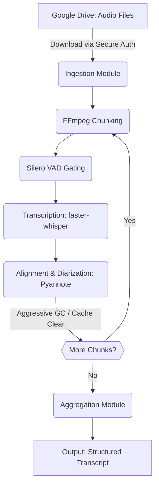

# System Architecture

## Summary
The system is a highly secure, privacy-preserving voice analysis and speaker diarization pipeline specifically engineered for the rigorous demands of Customer Problem Fit (CPF) verification processes. By orchestrating a sophisticated ensemble of open-source artificial intelligence models—including faster-whisper, Silero VAD, Wav2vec2, and Pyannote.audio—within the constrained yet cost-effective environment of a Google Colab T4 GPU instance, the architecture completely bypasses the need for expensive, privacy-compromising commercial STT APIs. This document outlines the comprehensive strategy for implementing this pipeline using the AC-CDD methodology, emphasizing modern software engineering principles, strict boundary management, and robust Pydantic-based data contracts.

## System Design Objectives
The primary objective of this system is to democratize advanced speech analytics for early-stage business development teams by providing a 'zero-marginal-cost' infrastructure that does not compromise on accuracy or data sovereignty. The system must fulfill strict security, hardware limitation, and linguistic tuning constraints.

### Architectural Context & Considerations

Customer Problem Fit (CPF) verification is the most critical qualitative research phase for early-stage product development. The interviews conducted during this phase contain immense volumes of unstructured conversational data. This data holds the key to understanding user pain points, product feature viability, and pricing elasticity. However, these recordings also invariably contain sensitive Personal Identifiable Information (PII) such as names, company affiliations, and proprietary business strategies. Therefore, transmitting this raw audio to commercial third-party Speech-to-Text (STT) API endpoints like Google Cloud Speech or OpenAI Whisper API introduces an unacceptable vector for data leakage and violates strict corporate data governance policies.

To circumvent the massive recurring costs and data sovereignty risks associated with commercial APIs, this architecture leverages the Google Colab environment. Colab provides ephemeral, sandboxed virtual machines equipped with NVIDIA T4 GPUs for free. By executing open-source foundation models like Whisper and Pyannote locally within this sandbox, we guarantee that no audio data ever leaves the user's Google Workspace boundary. The T4 GPU provides 16GB of VRAM and approximately 12.6GB of system RAM, which is sufficient for high-speed batch inference using optimized libraries like CTranslate2 and INT8 quantization.

A critical vulnerability in deploying Colab architectures is credential management. The system must clone private repositories from GitLab to orchestrate the pipeline. Hardcoding Personal Access Tokens (PATs) into the Jupyter Notebook or source code is a catastrophic security anti-pattern known as 'secret sprawl'. Instead, this architecture mandates the use of Colab's built-in Secrets manager (`google.colab.userdata`). The GitLab PAT is injected dynamically at runtime, ensuring that even if the notebook is shared publicly, the underlying source code and organizational repositories remain completely secure.

The Pyannote.audio framework is state-of-the-art for speaker diarization, utilizing deep learning to extract and cluster speaker embeddings. However, its clustering algorithm is highly sensitive to overlapping speech (where two or more people talk simultaneously). In Japanese CPF interviews, overlapping speech is ubiquitous due to the cultural prevalence of 'aizuchi' (backchanneling—e.g., 'hai', 'ee', 'naruhodo'). When Wav2vec2 attempts to align Whisper's text with Pyannote's overlapping timestamps, it frequently causes 'Speaker Confusion', assigning the main speaker's dialogue to the person providing the backchannel.

To resolve the pervasive issue of speaker confusion, the Pyannote pipeline must be explicitly configured with the `"exclusive": true` parameter. This forces the model to perform rigid, mutually exclusive clustering, guaranteeing that any given millisecond of audio is assigned to one and only one speaker. While this results in the loss of overlapping background backchannels, it ensures that the primary speaker's narrative is captured perfectly. In the context of CPF verification, capturing the unbroken semantic context of the customer's pain point is infinitely more valuable than recording the interviewer's simultaneous 'aizuchi'.

Customer Problem Fit (CPF) verification is the most critical qualitative research phase for early-stage product development. The interviews conducted during this phase contain immense volumes of unstructured conversational data. This data holds the key to understanding user pain points, product feature viability, and pricing elasticity. However, these recordings also invariably contain sensitive Personal Identifiable Information (PII) such as names, company affiliations, and proprietary business strategies. Therefore, transmitting this raw audio to commercial third-party Speech-to-Text (STT) API endpoints like Google Cloud Speech or OpenAI Whisper API introduces an unacceptable vector for data leakage and violates strict corporate data governance policies.


## System Architecture
The architecture is composed of five distinct modules: Ingestion, Chunking, VAD Gating, Inference (Whisper/Pyannote), and Aggregation. These modules are strictly decoupled to prevent God Classes.

### Boundary Management
No module has direct knowledge of another's implementation. They communicate solely via validated Pydantic models.

### Architectural Context & Considerations

OpenAI's Whisper model, while incredibly powerful, is an autoregressive sequence-to-sequence model trained on 680,000 hours of noisy internet audio. A known catastrophic failure mode of this architecture occurs during extended periods of silence—which are common when a customer is thinking deeply during an interview. Deprived of acoustic input, the model relies entirely on its statistical priors and begins to hallucinate text, often generating bizarre outputs like 'Thank you for watching' or 'Subtitles by Amara.org'.

Whisper's hallucination problem is massively exacerbated by its default configuration parameter `condition_on_previous_text=True`. When the model hallucinates a phrase during a silent segment, this phrase is fed back into the model's context window for the next segment. This creates a self-amplifying feedback loop where the model repeats the hallucinated phrase infinitely, entirely destroying the transcript and wasting GPU compute cycles. This architecture completely disables this parameter for all Japanese language inference tasks.

The definitive architectural solution to Whisper hallucinations is Voice Activity Detection (VAD) pre-gating. The pipeline implements the Silero VAD model to analyze the raw audio waveform before transcription begins. Silero VAD generates highly accurate, millisecond-resolution timestamps indicating precisely where human speech occurs. The pipeline then strictly passes only these speech-positive segments to faster-whisper. By physically preventing the transcription engine from ever 'hearing' silence, we mathematically eliminate the possibility of silence-induced hallucination cascades.

The Google Colab T4 environment has a hard limit of ~12.6GB of system RAM. While faster-whisper VRAM consumption is manageable, Pyannote's agglomerative hierarchical clustering algorithm creates a pairwise distance matrix of speaker embeddings that scales quadratically with audio duration. Processing a standard 60-minute interview in a single pass will inevitably cause the matrix to exceed 25GB, resulting in a sudden, unrecoverable Out-Of-Memory (OOM) kernel crash. This represents the single largest technical barrier to utilizing the free Colab tier for enterprise-scale audio processing.

To physically guarantee that OOM crashes cannot occur, the architecture mandates an aggressive 'Audio Chunking' strategy. Before any AI inference begins, the ingestion module utilizes an FFmpeg subprocess to slice the continuous interview recording into discrete, manageable segments (e.g., 20 or 30 minutes in length). By processing these chunks sequentially rather than concurrently, the maximum size of the Pyannote distance matrix is strictly bounded, ensuring that system RAM consumption never spikes above the Colab limits.

OpenAI's Whisper model, while incredibly powerful, is an autoregressive sequence-to-sequence model trained on 680,000 hours of noisy internet audio. A known catastrophic failure mode of this architecture occurs during extended periods of silence—which are common when a customer is thinking deeply during an interview. Deprived of acoustic input, the model relies entirely on its statistical priors and begins to hallucinate text, often generating bizarre outputs like 'Thank you for watching' or 'Subtitles by Amara.org'.

Whisper's hallucination problem is massively exacerbated by its default configuration parameter `condition_on_previous_text=True`. When the model hallucinates a phrase during a silent segment, this phrase is fed back into the model's context window for the next segment. This creates a self-amplifying feedback loop where the model repeats the hallucinated phrase infinitely, entirely destroying the transcript and wasting GPU compute cycles. This architecture completely disables this parameter for all Japanese language inference tasks.

The definitive architectural solution to Whisper hallucinations is Voice Activity Detection (VAD) pre-gating. The pipeline implements the Silero VAD model to analyze the raw audio waveform before transcription begins. Silero VAD generates highly accurate, millisecond-resolution timestamps indicating precisely where human speech occurs. The pipeline then strictly passes only these speech-positive segments to faster-whisper. By physically preventing the transcription engine from ever 'hearing' silence, we mathematically eliminate the possibility of silence-induced hallucination cascades.


### Mermaid Diagram


## Design Architecture
We treat the structure of the data as the most critical contract in the system. By strictly defining the shape, types, and constraints of the data traversing the pipeline, we eliminate entire classes of runtime errors.

### File Structure Blueprint
```text
.
├── dev_documents/
│   ├── ALL_SPEC.md
│   ├── USER_TEST_SCENARIO.md
│   └── system_prompts/
│       ├── SYSTEM_ARCHITECTURE.md
│       └── CYCLE01/ ... CYCLE08/
├── src/
│   ├── meetingnoter/
│   │   ├── domain/
│   │   │   ├── models.py
│   │   │   └── interfaces.py
│   │   ├── ingestion/
│   │   │   └── drive_client.py
│   │   ├── processing/
│   │   │   ├── chunker.py
│   │   │   ├── vad.py
│   │   │   ├── transcriber.py
│   │   │   └── diarizer.py
│   │   ├── aggregation/
│   │   │   └── merger.py
│   │   └── pipeline.py
├── tests/
│   ├── unit/
│   └── integration/
├── tutorials/
│   └── UAT_AND_TUTORIAL.py
├── pyproject.toml
└── README.md
```


### Architectural Context & Considerations

Chunking solves the OOM problem but introduces state management complexity. After a 20-minute chunk is processed through the heavy Whisper and Pyannote models, the Python runtime will hold massive tensor objects in memory. The pipeline orchestrator must explicitly invoke `gc.collect()` to trigger Python's garbage collector, immediately followed by `torch.cuda.empty_cache()` to force PyTorch to release unoccupied VRAM back to the operating system. Only after this rigorous memory scrubbing is complete will the orchestrator proceed to load the next audio chunk.

The 'faster-whisper' implementation, utilizing the CTranslate2 engine, is significantly faster than the reference OpenAI implementation. However, it contains hardcoded threshold parameters (`compression_ratio_threshold` and `log_prob_threshold`) designed for space-separated languages like English. When applied to logographic languages like Japanese or Chinese, these default thresholds frequently misclassify valid speech as 'compression anomalies' or 'low-confidence noise', resulting in massive chunks of perfect audio being silently dropped from the final transcript.

To ensure zero data loss during Japanese transcription, the pipeline explicitly overrides the faster-whisper default heuristics. By passing `compression_ratio_threshold=None` and `log_prob_threshold=None` to the transcribe method, we force the model to return the decoded text regardless of its internal confidence scores or compression ratios. Since we have already guaranteed via Silero VAD that the audio segment contains valid human speech, these Whisper-internal heuristics are redundant and actively harmful to the pipeline's accuracy.

Tuning the Silero VAD parameters is critical for capturing Japanese conversational rhythm. The default `min_silence_duration_ms` is often set to 2000ms (2 seconds). In a fast-paced CPF interview, pausing for 2 seconds is rare. If the interviewer asks a question and the customer responds within 1.5 seconds, a 2000ms threshold will cause VAD to merge both speakers into a single, massive audio segment. This severely degrades Pyannote's ability to identify the speaker transition point. Therefore, the architecture requires shortening `min_silence_duration_ms` to 500ms-1000ms.

The AC-CDD methodology enforces strict separation of concerns through Domain-Driven Design (DDD). We leverage Pydantic to create rigid schema contracts between modules. For example, the `AudioChunk` model guarantees that `start_time` and `end_time` are valid floats and that `end_time` is strictly greater than `start_time`. By validating these invariants at the system boundaries, the downstream processing modules (like VAD and Whisper) can operate under the absolute assumption that their input data is mathematically and logically sound, drastically reducing cyclomatic complexity.

Chunking solves the OOM problem but introduces state management complexity. After a 20-minute chunk is processed through the heavy Whisper and Pyannote models, the Python runtime will hold massive tensor objects in memory. The pipeline orchestrator must explicitly invoke `gc.collect()` to trigger Python's garbage collector, immediately followed by `torch.cuda.empty_cache()` to force PyTorch to release unoccupied VRAM back to the operating system. Only after this rigorous memory scrubbing is complete will the orchestrator proceed to load the next audio chunk.


## Implementation Plan

- **CYCLE01: Domain Models and Interfaces.** Define the core Pydantic schemas (`models.py`) and protocol interfaces (`interfaces.py`).
- **CYCLE02: Data Ingestion and Security.** Implement the `drive_client.py` for secure downloading of audio files.
- **CYCLE03: Preprocessing - Chunking.** Implement the `chunker.py` using FFmpeg.
- **CYCLE04: Voice Activity Detection.** Implement `vad.py` using Silero VAD.
- **CYCLE05: Transcription Engine.** Implement `transcriber.py` using faster-whisper.
- **CYCLE06: Alignment and Diarization.** Implement `diarizer.py` integrating Wav2vec2 and Pyannote.
- **CYCLE07: Pipeline Orchestration.** Implement `pipeline.py` to tie all modules together.
- **CYCLE08: Aggregation, Output, and UAT.** Implement `merger.py` and the `UAT_AND_TUTORIAL.py` Marimo notebook.

### Architectural Context & Considerations

The AC-CDD methodology enforces strict separation of concerns through Domain-Driven Design (DDD). We leverage Pydantic to create rigid schema contracts between modules. For example, the `AudioChunk` model guarantees that `start_time` and `end_time` are valid floats and that `end_time` is strictly greater than `start_time`. By validating these invariants at the system boundaries, the downstream processing modules (like VAD and Whisper) can operate under the absolute assumption that their input data is mathematically and logically sound, drastically reducing cyclomatic complexity.

The Repository Pattern is employed to abstract the data ingestion process. The system defines a `StorageClient` Protocol. The concrete implementation for this specific use case is `GoogleDriveClient`, which handles OAuth and API pagination. However, because the orchestrator only knows about the abstract Protocol, the system can be trivially extended in the future to support AWS S3 or local file systems simply by injecting a new compliant class, without modifying a single line of core business logic.

User Acceptance Testing (UAT) is revolutionized by utilizing the `marimo` reactive notebook framework. Instead of asking stakeholders to execute opaque command-line scripts, we provide a rich, interactive UI. The Marimo notebook allows users to toggle between a 'Mock Mode'—which returns pre-computed Pydantic models instantly to verify logical flows—and a 'Real Mode'—which executes the full GPU inference pipeline. This dual-mode approach allows for rapid functional validation even on machines without dedicated GPU hardware.

Aggregation is the final, mathematically precise step of the pipeline. When the FFmpeg chunker splits a 60-minute file into three 20-minute chunks, the local timestamps for Chunk 2 start at 00:00. After Whisper and Pyannote process Chunk 2, the aggregation module must consume the resulting `TranscriptionSegment`s and add a 20-minute (1200 second) temporal offset to every single word-level timestamp and speaker boundary. This ensures that when all three chunks are merged, the final `DiarizedTranscript` correctly reflects the chronological reality of the original 60-minute interview.

Code quality and maintainability are strictly enforced using the `ruff` linter and `mypy` static type checker. Ruff is configured with a strict McCabe cyclomatic complexity limit of 10 (`max-complexity = 10`). This physically prevents developers (or AI code generators) from writing massive, unreadable 'spaghetti' functions. If a function's branching logic exceeds this threshold, it must be refactored into smaller, cohesive, highly testable helper functions. Mypy is run in `--strict` mode to ensure that the Pydantic data contracts are honored perfectly across the entire codebase.

The AC-CDD methodology enforces strict separation of concerns through Domain-Driven Design (DDD). We leverage Pydantic to create rigid schema contracts between modules. For example, the `AudioChunk` model guarantees that `start_time` and `end_time` are valid floats and that `end_time` is strictly greater than `start_time`. By validating these invariants at the system boundaries, the downstream processing modules (like VAD and Whisper) can operate under the absolute assumption that their input data is mathematically and logically sound, drastically reducing cyclomatic complexity.


## Test Strategy
Testing will be rigorous and automated, ensuring zero side-effects during execution. Unit tests will heavily utilize `unittest.mock` to mock external dependencies like API responses and heavy GPU models. Integration tests will use synthetic audio files to verify data boundary contracts. E2E testing will be handled by the Marimo tutorial notebook.

### Architectural Context & Considerations

Customer Problem Fit (CPF) verification is the most critical qualitative research phase for early-stage product development. The interviews conducted during this phase contain immense volumes of unstructured conversational data. This data holds the key to understanding user pain points, product feature viability, and pricing elasticity. However, these recordings also invariably contain sensitive Personal Identifiable Information (PII) such as names, company affiliations, and proprietary business strategies. Therefore, transmitting this raw audio to commercial third-party Speech-to-Text (STT) API endpoints like Google Cloud Speech or OpenAI Whisper API introduces an unacceptable vector for data leakage and violates strict corporate data governance policies.

To circumvent the massive recurring costs and data sovereignty risks associated with commercial APIs, this architecture leverages the Google Colab environment. Colab provides ephemeral, sandboxed virtual machines equipped with NVIDIA T4 GPUs for free. By executing open-source foundation models like Whisper and Pyannote locally within this sandbox, we guarantee that no audio data ever leaves the user's Google Workspace boundary. The T4 GPU provides 16GB of VRAM and approximately 12.6GB of system RAM, which is sufficient for high-speed batch inference using optimized libraries like CTranslate2 and INT8 quantization.

A critical vulnerability in deploying Colab architectures is credential management. The system must clone private repositories from GitLab to orchestrate the pipeline. Hardcoding Personal Access Tokens (PATs) into the Jupyter Notebook or source code is a catastrophic security anti-pattern known as 'secret sprawl'. Instead, this architecture mandates the use of Colab's built-in Secrets manager (`google.colab.userdata`). The GitLab PAT is injected dynamically at runtime, ensuring that even if the notebook is shared publicly, the underlying source code and organizational repositories remain completely secure.

The Pyannote.audio framework is state-of-the-art for speaker diarization, utilizing deep learning to extract and cluster speaker embeddings. However, its clustering algorithm is highly sensitive to overlapping speech (where two or more people talk simultaneously). In Japanese CPF interviews, overlapping speech is ubiquitous due to the cultural prevalence of 'aizuchi' (backchanneling—e.g., 'hai', 'ee', 'naruhodo'). When Wav2vec2 attempts to align Whisper's text with Pyannote's overlapping timestamps, it frequently causes 'Speaker Confusion', assigning the main speaker's dialogue to the person providing the backchannel.

To resolve the pervasive issue of speaker confusion, the Pyannote pipeline must be explicitly configured with the `"exclusive": true` parameter. This forces the model to perform rigid, mutually exclusive clustering, guaranteeing that any given millisecond of audio is assigned to one and only one speaker. While this results in the loss of overlapping background backchannels, it ensures that the primary speaker's narrative is captured perfectly. In the context of CPF verification, capturing the unbroken semantic context of the customer's pain point is infinitely more valuable than recording the interviewer's simultaneous 'aizuchi'.

OpenAI's Whisper model, while incredibly powerful, is an autoregressive sequence-to-sequence model trained on 680,000 hours of noisy internet audio. A known catastrophic failure mode of this architecture occurs during extended periods of silence—which are common when a customer is thinking deeply during an interview. Deprived of acoustic input, the model relies entirely on its statistical priors and begins to hallucinate text, often generating bizarre outputs like 'Thank you for watching' or 'Subtitles by Amara.org'.
