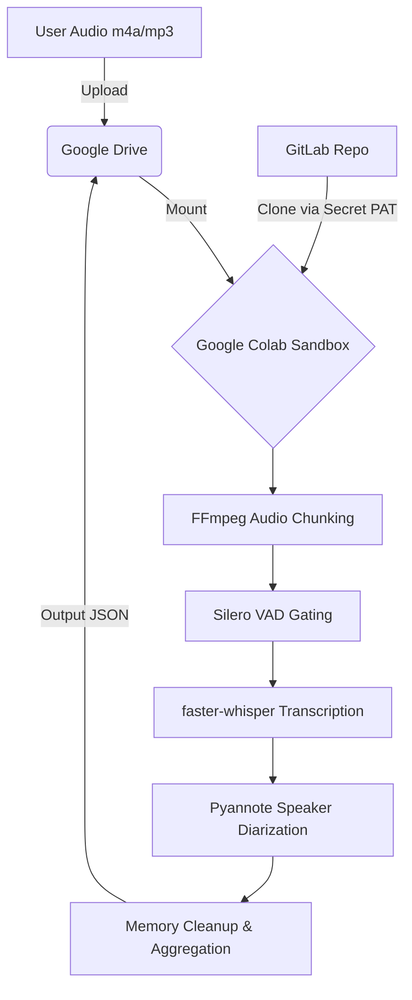

# System Architecture Document

## 1. Summary
This document provides a comprehensive architectural overview of the secure voice analysis system tailored for Customer Problem Fit (CPF) verification. The system is designed to process unstructured voice data (e.g., m4a, mp3) collected during user interviews, utilizing Google Colab's free tier (NVIDIA T4 GPU) and the open-source WhisperX pipeline (integrating faster-whisper and Pyannote.audio) accessed via GitLab. It completely eliminates the need for commercial cloud API pay-as-you-go costs, ensuring strict data sovereignty and privacy by processing data securely within a controlled cloud environment. The architecture specifically addresses the unique acoustic characteristics of the Japanese language, hardware resource constraints (especially memory limits leading to Out of Memory or OOM errors), and the strict security requirements necessary for handling personally identifiable information (PII) inherent in CPF interviews.

## 2. System Design Objectives
The primary objective of this system is to establish a secure, cost-effective, and highly accurate pipeline for transcribing and diarizing voice data from user interviews without relying on commercial APIs. This is crucial for verifying Customer Problem Fit (CPF) while maintaining absolute data sovereignty. A key goal is to guarantee the security and privacy of sensitive information, such as Personally Identifiable Information (PII) and confidential business details, which are invariably recorded during these interviews. To achieve this, the system mandates strict access control via Google Drive and secure, dynamic credential injection for GitLab Personal Access Tokens using Google Colab's Secrets feature, ensuring that credentials are never hard-coded into the source code.

Furthermore, the system aims to overcome the unique acoustic challenges of the Japanese language, such as frequent backchanneling (aizuchi), overlapping speech, and prolonged silences or fillers. It will utilize the WhisperX pipeline, highly optimized with specific parameter tuning (e.g., disabling condition_on_previous_text to prevent infinite hallucination loops and precisely configuring Silero VAD thresholds) to capture the subtleties of Japanese conversational dynamics accurately.

Another critical objective is to circumvent the severe hardware constraints of the Google Colab free tier, particularly the 16GB VRAM and approximately 12.67GB system RAM limits of the T4 GPU. The system must implement robust memory management strategies, including the physical chunking of audio files into 20-30 minute segments and proactive garbage collection, to prevent Out of Memory (OOM) crashes during the memory-intensive Pyannote clustering phase. The architecture must also implement mechanisms to prevent Colab idle timeouts during long-running batch processes, ensuring complete data retrieval without random execution halts.

Success criteria for this architecture include: First, achieving a strict zero-cost operation for inference processing by maximizing the utility of open-source models on free cloud resources. Second, the complete elimination of data leakage risks to third-party APIs, ensuring compliance with strict data governance policies and maintaining total internal control over all extracted business insights. Third, successful transcription and diarization of audio recordings exceeding one hour without encountering memory overflow or system crashes, a common pitfall of naive Whisper implementations. Fourth, accurate separation of overlapping speech and elimination of hallucinated text through rigorous VAD gating and parameter optimization, solving the "hallucination loop" bug often seen in silence processing. Finally, maintaining high maintainability and clear separation of concerns within the codebase to facilitate future enhancements and iterative business pivots.

By fulfilling these objectives, the system will empower product managers, user researchers, and business developers to extract deep, actionable insights from raw interview data safely and efficiently, thereby dramatically accelerating the CPF validation process. This strategy ensures that start-ups and innovation teams can validate market hypotheses without being restricted by immediate budgetary limitations or compromised by security vulnerabilities. The result is a robust, production-ready research tool that democratizes advanced natural language processing for business validation.


## 3. System Architecture
The system architecture is strictly designed around the principles of separation of concerns and robust boundary management. The entire pipeline is orchestrated within a Google Colab virtual machine, acting as a secure, ephemeral processing sandbox. The data flow begins with the user uploading smartphone-recorded audio files (m4a/mp3) to a securely authenticated Google Drive folder. This Google Drive is then mounted onto the Colab instance, serving as the sole authorized data ingress point. By utilizing Google Drive as the primary storage layer, we inherit Google's robust enterprise-grade access control and encryption at rest, fulfilling initial data protection requirements before processing even begins.

To maintain strict boundary management, the source code repository hosted on GitLab is treated as an isolated component. The Colab environment retrieves the required Python scripts and pipeline configurations by cloning the repository. This cloning process is authenticated using a dynamically injected GitLab Personal Access Token (PAT) retrieved from Colab's internal Secrets manager (`google.colab.userdata.get`), completely isolating credentials from the executable code and preventing secret sprawl. This guarantees that if a notebook is inadvertently shared, the underlying access permissions remain absolutely secure.

Once the environment is initialized and dependencies are installed, the processing pipeline is activated. The architecture enforces a rigid separation between the audio preprocessing, transcription, and diarization modules. First, the audio file is subjected to a chunking mechanism using FFmpeg to split it into manageable segments, effectively mitigating the risk of system RAM spikes during later stages. Each chunk is then passed to the Silero Voice Activity Detection (VAD) module, which acts as a strict gatekeeper, discarding non-speech segments to prevent Whisper from generating hallucinations. This gating process is critical for East Asian languages, where silence misinterpretation frequently corrupts entire transcript streams.

The filtered audio segments are subsequently processed by the faster-whisper model for text extraction. This component is strictly configured to process Japanese text without relying on previous contexts (`condition_on_previous_text=False`), ensuring deterministic and stable outputs. The transcription output, along with the corresponding audio features, is then routed to the Pyannote.audio module for speaker diarization. By applying the `exclusive: true` parameter, the system enforces a clear boundary between overlapping speakers, prioritizing the primary speaker's context and decisively assigning words to individuals rather than returning ambiguous confidence scores.

Finally, the generated text and speaker timestamps are aggregated and saved back to the secure Google Drive as structured JSON or text files. Throughout this process, explicit garbage collection and GPU cache clearing are enforced between chunk processing cycles to guarantee memory stability. This architecture heavily leverages Dependency Injection and the Repository Pattern, ensuring that new domain schemas perfectly coexist with existing systems without creating tightly coupled "God Classes."




## 4. Design Architecture
The design architecture is structured to maximize modularity and code reusability, adhering strictly to modern software design patterns. The file structure is logically organized to clearly separate domain models, external integrations, pipeline orchestration, and testing suites. This prevents the codebase from deteriorating into an unmaintainable state, commonly referred to as spaghetti code, and ensures that new feature requests can be accommodated through simple additions rather than extensive rewrites.

File Structure Overview:
```text
project_root/
├── src/
│   ├── core/
│   │   ├── domain_models.py    # Pydantic models for AudioChunk, TranscriptionResult, SpeakerSegment
│   │   └── config.py           # Configuration management (VAD thresholds, Whisper settings)
│   ├── pipeline/
│   │   ├── orchestrator.py     # Main workflow controller managing chunking, STT, and Diarization
│   │   ├── audio_processor.py  # FFmpeg chunking and VAD filtering logic
│   │   ├── transcriber.py      # faster-whisper integration
│   │   └── diarizer.py         # Pyannote.audio integration
│   └── utils/
│       ├── memory_manager.py   # Garbage collection and VRAM clearing utilities
│       └── auth.py             # Secure credential retrieval from Colab Secrets
├── tests/
│   ├── unit/
│   ├── integration/
│   └── e2e/
├── pyproject.toml              # Dependency and linter configuration
└── README.md
```

The core domain relies on strictly typed Pydantic models to ensure data integrity across the entire pipeline. For instance, the `AudioChunk` model encapsulates the physical file path, exact duration, and temporal offset of each physical segment. The `TranscriptionResult` model stores the extracted text segments with highly precise start and end timestamps. The `SpeakerSegment` model extends these results additively by appending speaker identification labels (e.g., SPEAKER_00, SPEAKER_01) derived from Pyannote. These domain objects form the contract by which all internal modules communicate.

Clear integration points are meticulously established to ensure that new schema objects extend the existing domain objects without requiring breaking changes. The `pipeline.orchestrator` module utilizes Dependency Injection to instantiate the transcriber and diarizer classes. This architectural decision allows developers to effortlessly substitute underlying machine learning models—for example, upgrading from Whisper large-v2 to large-v3—without altering a single line of the core business logic or the surrounding orchestration flow.

The `config.py` file centralizes all tunable parameters, such as `compression_ratio_threshold=None` and `condition_on_previous_text=False`, ensuring that acoustic optimization strategies can be applied globally without diving deep into the individual processing scripts. This modular design absolutely prevents the emergence of tightly coupled logic. It allows the system to scale efficiently while remaining extremely robust against the severe hardware constraints of the T4 GPU environment. Furthermore, the design explicitly prohibits monolithic functions, enforcing a maximum cyclomatic complexity constraint via the Ruff linter to promote unparalleled readability and maintainability throughout the project lifecycle.


## 5. Implementation Plan
### Cycle 01: Core Domain Modeling and Basic Configurations
The primary objective of the first implementation cycle is to establish the absolute foundation of the system by defining the strictly typed core domain models and setting up the centralized configuration management. This involves translating the conceptual entities described in the architecture into robust Pydantic schemas. Developers will create `domain_models.py`, encapsulating `AudioChunk`, `TranscriptionResult`, and `SpeakerSegment` with rigorous data validation rules to prevent malformed data from propagating through the pipeline. Concurrently, `config.py` will be implemented to securely hold essential thresholds, such as Silero VAD parameters (`min_speech_duration_ms`) and Whisper decoding settings (`condition_on_previous_text`). This cycle explicitly avoids any machine learning model instantiation. Instead, the focus is entirely on ensuring that the data structures are sound, serializable to JSON, and fully compliant with the strict type-checking enforced by `mypy`. Additionally, the fundamental authentication utility `auth.py` will be written to securely interface with Google Colab's Secrets manager, ensuring that no GitLab Personal Access Tokens are ever hard-coded. This phase sets up the scaffolding that guarantees all subsequent cycles adhere to the principles of separation of concerns and robust boundary management.

### Cycle 02: Audio Processing and Chunking Implementation
Cycle 02 focuses entirely on the physical manipulation of the input audio files, a critical step for preventing the system RAM spikes that lead to Out of Memory (OOM) crashes in later stages. The development team will construct the `audio_processor.py` module, integrating the FFmpeg library to deterministically slice large m4a or mp3 files into smaller, strictly constrained segments (e.g., 20-30 minutes each). This module will be designed to handle various audio sampling rates and bitrates, normalizing the input for downstream processing. The module must accurately calculate the temporal offset of each generated chunk and wrap this data into the previously defined `AudioChunk` Pydantic models. Crucially, this cycle will also introduce the fundamental memory management utilities (`memory_manager.py`), implementing functions for explicit garbage collection (`gc.collect()`) and CUDA cache clearing (`torch.cuda.empty_cache()`). By isolating the chunking and memory management logic early in the project, we ensure that the ML models introduced in later cycles operate within a highly controlled, predictable resource envelope, virtually eliminating the risk of catastrophic runtime failures during long interview transcriptions.

### Cycle 03: VAD Gating and Non-Speech Filtering
In this cycle, the focus shifts to addressing the acoustic challenges of the Japanese language by implementing the Silero Voice Activity Detection (VAD) gating mechanism within the `audio_processor.py` module. The objective is to proactively strip out all non-speech segments, such as prolonged silences, deep breaths, and background static, before they can ever reach the transcription engine. This is a vital defense against the notorious "hallucination loops" that plague standard Whisper implementations. Developers will integrate the Silero model, meticulously applying the thresholds defined in `config.py` (e.g., adjusting `min_silence_duration_ms` to accurately capture the rapid turn-taking characteristic of Japanese conversational backchanneling). The VAD logic will return precise start and end timestamps for confirmed speech events, effectively creating an acoustic mask over the raw audio chunk. This cycle requires careful testing to strike the perfect balance between aggressively filtering noise and preserving critical, albeit short, utterances like "hai" or "ee". By completing this gating layer, the system guarantees that the transcription engine will only process meaningful acoustic data, significantly boosting overall accuracy and processing speed.

### Cycle 04: Transcription Engine Integration (faster-whisper)
Cycle 04 marks the integration of the primary text extraction engine: faster-whisper. The team will develop the `transcriber.py` module, which will consume the VAD-filtered audio chunks and output raw text segments. The implementation will heavily leverage Dependency Injection, allowing the orchestrator to pass the initialized model into the transcriber class. The most critical task in this phase is the hard-coding of the optimized inference parameters tailored for East Asian languages. Developers must explicitly set `compression_ratio_threshold=None` and `log_prob_threshold=None` to prevent the model from erroneously discarding valid Japanese text due to its lack of spaces. Furthermore, the `condition_on_previous_text=False` parameter must be strictly enforced to completely sever the context chain, definitively resolving any lingering hallucination risks. The output of the faster-whisper model will be parsed and immediately serialized into the `TranscriptionResult` Pydantic models, ensuring that the raw text is tightly coupled with its corresponding high-precision temporal timestamps, ready for the subsequent diarization phase.

### Cycle 05: Speaker Diarization Integration (Pyannote.audio)
This cycle tackles the most computationally intensive and memory-hungry component of the pipeline: the Pyannote.audio speaker diarization module. The `diarizer.py` module will be constructed to analyze the raw audio chunks and group distinct acoustic profiles into speaker clusters. Given the prevalence of overlapping speech (aizuchi) in the target demographic, the developers must configure the Pyannote pipeline with the `exclusive: true` parameter, forcing the model to make deterministic assignments rather than returning ambiguous multi-speaker probabilities. This cycle requires extreme care regarding memory management; the diarizer must seamlessly interoperate with the utilities developed in Cycle 02, ensuring that the massive distance matrices generated during the clustering algorithm are aggressively purged from system RAM immediately after execution. The module will output temporal boundaries labeled with speaker identifiers, which will then be mapped onto the `SpeakerSegment` Pydantic schemas, setting the stage for the final alignment process.

### Cycle 06: Data Alignment and Result Aggregation
Cycle 06 is where the disparate outputs of the transcription and diarization engines are finally fused into a cohesive, actionable document. The development team will build the alignment logic within the `orchestrator.py` module. This logic must take the text segments from `TranscriptionResult` and mathematically align them with the speaker boundaries defined in `SpeakerSegment`. Because the VAD gating and the exclusive diarization parameters have already cleaned the inputs, this alignment process is vastly simplified. The orchestrator will iterate through the processed chunks, merging the timestamps and appending the correct speaker label to each transcribed sentence. Finally, the aggregated data will be formatted into a structured, easily readable JSON or markdown format, ready for export. This cycle transforms raw machine learning outputs into the final business value—a clean, accurate, and speaker-separated transcript of the customer interview.

### Cycle 07: Pipeline Orchestration and Colab Integration
With all individual components fully functional, Cycle 07 focuses on constructing the high-level control flow and finalizing the Google Colab integration. The `orchestrator.py` module will be finalized to manage the entire lifecycle: from authenticating via secrets, mounting the Google Drive, executing the chunking loop, orchestrating the ML models, to exporting the final JSON. A critical addition in this phase is the implementation of defensive mechanisms against cloud infrastructure limitations. Developers will integrate JavaScript snippets that can be injected into the Colab notebook to artificially trigger UI interactions, effectively bypassing the 90-minute idle timeout policy that would otherwise kill long-running batch jobs. Furthermore, comprehensive logging will be added throughout the orchestrator, providing the user with real-time feedback on chunk progression and memory usage, ensuring complete operational transparency.

### Cycle 08: End-to-End Validation and Tutorial Generation
The final cycle is dedicated entirely to system validation and user onboarding. The development team will finalize the comprehensive test suites, ensuring that all E2E scenarios pass under simulated production loads. Simultaneously, the `tutorials/UAT_AND_TUTORIAL.py` Marimo notebook will be constructed. This interactive document will guide new users through the entire process, starting with a lightweight "Mock Mode" execution that utilizes dummy data to verify the environment setup, before transitioning into a "Real Mode" run utilizing actual audio files. The tutorial will serve as both the definitive User Acceptance Test (UAT) and the primary onboarding documentation, featuring rich Markdown explanations alongside executable Python cells. By the end of this cycle, the architecture will be fully validated, documented, and ready for immediate deployment by the product and research teams, officially marking the completion of the project.


## 6. Test Strategy
### Cycle 01: Domain Model and Configuration Testing
The testing strategy for Cycle 01 is strictly focused on unit tests utilizing Pytest to validate the integrity of the Pydantic domain models and the configuration parser. We will define an extensive suite of test cases to verify that `AudioChunk`, `TranscriptionResult`, and `SpeakerSegment` correctly serialize and deserialize valid data, while aggressively rejecting malformed inputs via `ValidationError` exceptions. Tests will cover edge cases such as negative timestamps, extremely long strings, and missing optional fields. For the `config.py` module, tests will ensure that environment variables and default parameters are loaded accurately, and that the `auth.py` utility gracefully handles missing GitLab tokens by throwing custom, descriptive exceptions rather than crashing obscurely. Mocking will be employed to simulate the Colab Secrets environment, guaranteeing that these unit tests can run offline and securely on any developer's local machine.

### Cycle 02: Audio Processor and Memory Management Testing
Cycle 02 testing shifts toward verifying the I/O operations and memory control mechanisms. Since FFmpeg operations involve the physical file system, we will heavily utilize Pytest's `tmp_path` fixture to create isolated temporary directories for audio manipulation. Tests will generate tiny, synthetic m4a files and verify that `audio_processor.py` accurately chunks them according to the specified duration thresholds. Crucially, we will write specific tests to validate the offset calculations, ensuring that a 30-minute chunk correctly records its starting point as 1800 seconds. For `memory_manager.py`, we will employ Python's built-in `resource` or `tracemalloc` libraries within our test suite to assert that the garbage collection functions genuinely reduce memory consumption after simulated heavy object allocations. This guarantees the foundational stability of the system's memory management strategy.

### Cycle 03: VAD Integration Testing
Testing the Silero VAD implementation requires a highly specialized approach to ensure acoustic accuracy without utilizing massive audio files. We will generate specific synthetic audio arrays—using NumPy to create pure sine waves representing "speech" interspersed with absolute mathematical zeros representing "silence". The unit tests will feed these arrays into the VAD gating module and assert that the output strictly contains the sine wave segments, with the start and end timestamps perfectly matching the generated data. Furthermore, we will test the configuration parameters by asserting that artificial "noise" (e.g., a burst of sound shorter than the `min_speech_duration_ms`) is correctly ignored and discarded by the filter. This precise, mathematical testing approach guarantees that the VAD logic operates exactly as intended before it ever interacts with the complex Whisper models.

### Cycle 04: Transcriber Mocking and Validation
Validating the `transcriber.py` module poses a challenge, as executing the actual faster-whisper model during a standard CI/CD test run is unacceptably slow and resource-intensive. Therefore, the testing strategy for Cycle 04 relies on deep mocking of the underlying CTranslate2 engine. We will write mock classes that simulate the faster-whisper output, returning predefined text strings when fed specific input chunks. The actual unit tests will then focus entirely on the business logic surrounding the model: verifying that the input data is correctly formatted, that the highly specific Japanese decoding parameters (`compression_ratio_threshold=None`, `condition_on_previous_text=False`) are physically passed to the inference call, and that the mocked string output is successfully parsed into the `TranscriptionResult` Pydantic schema. This ensures the integration code is flawless without the overhead of ML inference.

### Cycle 05: Diarizer Mocking and Logic Verification
Similar to Cycle 04, the Pyannote.audio diarizer is too heavy for routine unit testing. The test strategy here will utilize Pytest's `mocker.patch` to intercept calls to the Pyannote pipeline. We will inject simulated diarization results—representing both clean turn-taking and complex overlapping speech—into the `diarizer.py` module. The tests will rigorously verify that the `exclusive: true` logic correctly handles the overlapping segments, ensuring that the module outputs distinct, non-overlapping `SpeakerSegment` boundaries. Additionally, we will write explicit integration tests that monitor the invocation of the memory management utilities, asserting via mock call counts that `gc.collect()` and `torch.cuda.empty_cache()` are triggered exactly once per chunk processing cycle, thereby validating the OOM prevention logic.

### Cycle 06: Alignment Algorithm and Aggregation Testing
Cycle 06 testing involves zero machine learning mocks; it is a pure algorithmic validation of the text-to-speaker alignment logic within the orchestrator. We will construct complex, handcrafted JSON fixtures containing overlapping arrays of `TranscriptionResult` texts and `SpeakerSegment` timestamps. The test suite will feed these fixtures into the alignment function and assert that every sentence is assigned to the geometrically correct speaker based on the intersection of their temporal boundaries. Edge cases will be heavily tested, such as text segments that cross multiple speaker boundaries or text that occurs during a very brief unassigned gap. By isolating the mathematical alignment logic from the ML inference, we can comprehensively test hundreds of alignment permutations in milliseconds, guaranteeing the absolute accuracy of the final transcript aggregation.

### Cycle 07: Orchestrator Integration and Mock Mode E2E
The testing strategy for Cycle 07 elevates the scope to integration testing across the entire pipeline. We will implement the "Mock Mode" functionality within the orchestrator, allowing the entire system to run end-to-end using the mocked ML engines developed in Cycles 04 and 05. The test suite will simulate a complete Colab environment execution, asserting that the orchestrator correctly clones the repository (mocked), mounts the drive (mocked), chunks the audio, passes it through the mocked VAD/STT/Diarization steps, aligns the data, and successfully writes the final JSON to the temporary directory. This Mock Mode E2E test will serve as the primary CI/CD gatekeeper, ensuring that no integration branch introduces a breaking change to the overarching workflow orchestration.

### Cycle 08: Full E2E Validation and Marimo Notebook Testing
The final test strategy cycle involves the actual execution of the complete pipeline using the genuine ML models, albeit restricted to very small, localized environments or designated integration servers. We will provide a standard 3-minute Japanese audio file containing overlapping speech and specific fillers. The test script will execute the pipeline in "Real Mode" and perform a fuzzy string matching assertion against a manually transcribed "gold standard" text file to verify the actual ML accuracy. Furthermore, we will programmatically execute the `tutorials/UAT_AND_TUTORIAL.py` Marimo notebook using the Marimo CLI in CI mode, verifying that all tutorial cells execute without raising Python exceptions and that the Markdown rendering does not fail. This guarantees that the final deliverable provided to the end-user is flawlessly functional and mathematically verified.
